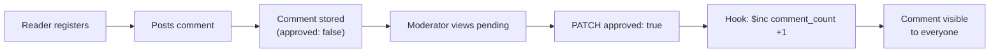
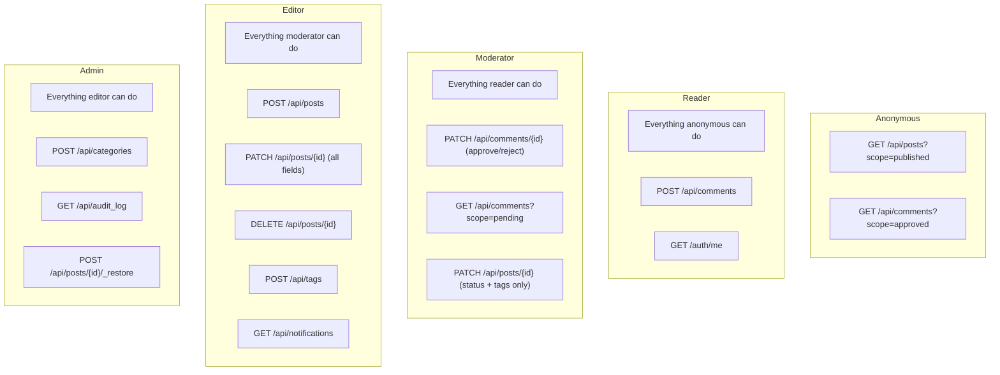

# Blog 101 — Building a Production Blog with Zero Code

A step-by-step guide to building **The Zero-Code Blog**: a fully functional
blog platform with public reading, role-based authoring, authenticated comments,
comment moderation, conditional notifications, denormalized counters, cascade
deletes, audit trails, server-side rendering, and scheduled jobs — all from a
single `manifest.json` file.

---

## Table of Contents

1. [What We're Building](#1-what-were-building)
2. [Prerequisites](#2-prerequisites)
3. [Quick Start](#3-quick-start)
4. [The Manifest, Section by Section](#4-the-manifest-section-by-section)
5. [Access Control Model](#5-access-control-model)
6. [Data Flow Walkthroughs](#6-data-flow-walkthroughs)
7. [The Frontend](#7-the-frontend)
8. [Server-Side Rendering (SSR)](#8-server-side-rendering-ssr)
9. [Scheduled Jobs](#9-scheduled-jobs)
10. [Security Checklist](#10-security-checklist)
11. [Extending the Blog](#11-extending-the-blog)
12. [Appendix A — Full Manifest](#appendix-a--full-manifest)
13. [Appendix B — curl Command Reference](#appendix-b--curl-command-reference)
14. [Appendix C — Scopes Reference](#appendix-c--scopes-reference)
15. [Appendix D — Hooks Reference](#appendix-d--hooks-reference)

---

## 1. What We're Building

A production-grade blog with these capabilities:

- **Public blog feed** — anyone can read published posts, no login required
- **Role hierarchy** — admin > editor > moderator > reader, each with scoped
  permissions
- **Per-role writable fields** — editors can write full posts, moderators can
  only change status and tags
- **Authenticated comments** — readers register and leave comments
- **Comment moderation** — comments start as pending, moderators approve them
- **Admin authoring** — editors write, edit, publish, archive, and trash posts
- **Soft delete** — deleted posts go to trash and can be restored
- **Denormalized comment counts** — maintained via atomic `$inc` hooks on
  comment approval/unapproval, never stale
- **Conditional publish notifications** — a notification is created only when a
  post transitions to "published" for the first time
- **Cascade delete** — deleting a post cascades to its comments (both hard and
  soft delete)
- **Referential integrity** — `x-references` on `comments.post_id` prevents
  orphaned comments
- **Tag validation** — `x-values-from` on `posts.tags` ensures only tags from
  the `tags` collection are used
- **Automatic audit trail** — every create/update/delete logged via hooks, with
  `old_status`/`new_status` tracking
- **Auto-expiring audit logs** — TTL index cleans up entries after 90 days
- **Auto-expiring notifications** — TTL index cleans up after 7 days
- **Unique categories and tags** — `x-unique` constraint prevents duplicates
- **Schema validation** — invalid documents rejected before they hit the DB
- **Cache directives** — published posts cached for 5 minutes with
  stale-while-revalidate
- **Scheduled job** — stale drafts (>90 days untouched) auto-archived daily
- **Server-side rendering** — SEO-friendly HTML pages with JSON-LD, Open Graph,
  and auto-generated sitemap
- **Managed indexes** — compound indexes for common query patterns

The entire backend is a single JSON file. No Python. No Express. No Django.

Six collections: **posts**, **comments**, **categories**, **tags**,
**notifications**, **audit_log**.

```
zero_code_api/
├── manifest.json        ← the entire API
├── public/
│   ├── index.html       ← the blog SPA (auto-served at /)
│   ├── about.html
│   ├── community.html
│   └── js/
│       └── page-shell.js
├── templates/
│   ├── index.html       ← SSR homepage template
│   ├── post.html        ← SSR single-post template
│   ├── 404.html         ← custom 404 page
│   └── 500.html         ← custom 500 page
├── docker-compose.yml   ← one-command setup
├── blog.md              ← architecture walkthrough
├── MDB_ENGINE_101.md    ← framework deep-dive
├── BLOG_101.md          ← this file
└── README.md
```

---

## 2. Prerequisites

**Option A — Docker (recommended):**

- Docker and Docker Compose

**Option B — Local:**

- Python >= 3.10
- MongoDB running locally (or a remote URI)
- `pip install mdb-engine uvicorn`

**Environment Variables:**

| Variable | Required | Purpose |
|---|---|---|
| `ADMIN_EMAIL` | Yes | Admin user email (resolved via `{{env.ADMIN_EMAIL}}`) |
| `ADMIN_PASSWORD` | Yes | Admin user password (resolved via `{{env.ADMIN_PASSWORD}}`) |
| `MDB_JWT_SECRET` | Production | JWT signing secret (>= 32 chars) |
| `MDB_ENGINE_MASTER_KEY` | Production | Master encryption key (>= 32 chars) |

---

## 3. Quick Start

### Docker

```bash
docker compose up
```

Override admin credentials:

```bash
ADMIN_EMAIL=me@corp.com ADMIN_PASSWORD=supersecret docker compose up
```

### Local

```bash
pip install mdb-engine uvicorn

ADMIN_EMAIL=admin@example.com ADMIN_PASSWORD=admin123 \
  mdb-engine serve manifest.json --reload
```

### CLI Admin Provisioning (No Secrets in Env)

```bash
mdb-engine add-user manifest.json --email admin@corp.com --role admin
# Password: ********
# Confirm: ********
# User admin@corp.com created with role 'admin'.
```

**Open the blog:** http://localhost:8000
**Swagger docs:** http://localhost:8000/docs

---

## 4. The Manifest, Section by Section

### 4.1 Top-Level Metadata

```json
{
  "schema_version": "2.0",
  "slug": "zero_code_blog",
  "name": "Zero-Code Blog"
}
```

- `schema_version` — manifest format version (always `"2.0"`)
- `slug` — unique app identifier, used for `app_id` scoping in MongoDB
- `name` — human-readable name shown in OpenAPI docs

### 4.2 Authentication

```json
{
  "auth": {
    "mode": "app",
    "users": {
      "enabled": true,
      "strategy": "app_users",
      "allow_registration": true,
      "registration_role": "reader",
      "max_login_attempts": 5,
      "login_lockout_seconds": 900,
      "session_cookie_name": "blog_session",
      "role_hierarchy": {
        "admin": ["editor", "moderator", "reader"],
        "editor": ["reader"],
        "moderator": ["reader"]
      },
      "demo_users": [
        {
          "email": "{{env.ADMIN_EMAIL}}",
          "password": "{{env.ADMIN_PASSWORD}}",
          "role": "admin"
        }
      ]
    }
  }
}
```

**What each key does:**

| Key | Value | Effect |
|---|---|---|
| `enabled: true` | Turns on **secure-by-default** | Every endpoint requires auth unless `public_read` is set |
| `strategy: "app_users"` | Users stored in app's own collection | Independent from other apps |
| `allow_registration: true` | Public registration open | Anyone can create an account |
| `registration_role: "reader"` | New users get "reader" role | Cannot write posts (need "editor") |
| `max_login_attempts: 5` | Rate limit on login | 5 attempts per email per lockout period |
| `login_lockout_seconds: 900` | 15-minute lockout | After 5 failed attempts |
| `session_cookie_name` | Custom cookie name | Avoids collisions with other apps |
| `role_hierarchy` | Defines which roles inherit permissions from which | admin can do everything editor, moderator, and reader can; editor and moderator both inherit from reader |
| `demo_users` | Seed admin at startup | `{{env.*}}` placeholders resolved from environment |

**Role Hierarchy Explained:**

The `role_hierarchy` block defines a directed permission graph:

```
admin ──▶ editor ──▶ reader
  │                    ▲
  └──▶ moderator ──────┘
```

- **admin** inherits all permissions from editor, moderator, and reader
- **editor** inherits from reader — can read and create comments, plus write
  posts
- **moderator** inherits from reader — can read and create comments, plus
  moderate (approve/reject) comments and manage tags on posts
- **reader** — base role; can read public content and create comments

When a collection sets `write_roles: ["editor"]`, both editors and admins can
write (because admin inherits editor). When it sets `write_roles: ["moderator"]`,
moderators and admins can write.

**Why `{{env.*}}`?** The manifest never contains plaintext credentials. The
engine resolves `{{env.ADMIN_EMAIL}}` from the `$ADMIN_EMAIL` environment
variable at startup. This means the manifest is safe to commit to version
control.

**Generated auth endpoints:**

| Method | Path | Description |
|---|---|---|
| POST | `/auth/register` | Create account (gets "reader" role) |
| POST | `/auth/login` | Authenticate, returns session cookie |
| POST | `/auth/logout` | End session |
| GET | `/auth/me` | Current session info (`{authenticated, user}`) |

### 4.3 Posts Collection

The posts collection is the heart of the blog. It showcases the most manifest
features in one place.

```json
"posts": {
  "auto_crud": true,
  "soft_delete": true,
  "auth": { "public_read": true, "write_roles": ["editor"] },
  "owner_field": "author_id",
  "immutable_fields": ["author_id"],
  "writable_fields": {
    "editor": ["title", "body", "author", "status", "tags"],
    "moderator": ["status", "tags"]
  },
  "schema": { ... },
  "defaults": { ... },
  "scopes": { ... },
  "pipelines": { ... },
  "relations": { ... },
  "hooks": { ... },
  "cascade": { ... },
  "cache": { ... }
}
```

Let's break down each section:

#### Schema Validation

```json
"schema": {
  "type": "object",
  "properties": {
    "title":         { "type": "string" },
    "body":          { "type": "string" },
    "author":        { "type": "string" },
    "status":        { "type": "string", "enum": ["draft", "published", "archived"] },
    "tags":          { "type": "array", "items": { "type": "string" }, "x-values-from": { "collection": "tags", "field": "name" } },
    "comment_count": { "type": "integer" }
  },
  "required": ["title"]
}
```

- `title` is required — POST without it returns 422
- `status` must be one of `draft`, `published`, `archived` — invalid values
  return 422
- `tags` must be an array of strings, and each value is validated against the
  `tags` collection's `name` field via `x-values-from`. If you try to add a tag
  that doesn't exist in the tags collection, you get a 422.
- `comment_count` is an integer field maintained by hooks (see below), defaulting
  to 0. It is **not** in `writable_fields` — clients cannot set it directly.

#### Defaults

```json
"defaults": {
  "status": "draft",
  "tags": [],
  "comment_count": 0,
  "author": "{{user.email}}"
}
```

Applied on create via `setdefault` — caller-provided values take precedence.

- `status` defaults to `"draft"` — new posts are not published unless the editor
  explicitly sets `"status": "published"`
- `tags` defaults to `[]` — avoids null arrays
- `comment_count` defaults to `0` — starts at zero, incremented/decremented by
  hooks when comments are approved or unapproved
- `author` auto-fills from the authenticated user's email

#### Scopes

```json
"scopes": {
  "published": { "status": "published" },
  "drafts":    { "status": "draft" },
  "archived":  { "status": "archived" }
}
```

Scopes are named MQL filters activated via the `?scope=` query parameter:

```bash
GET /api/posts?scope=published          # Only published posts
GET /api/posts?scope=drafts             # Only drafts
GET /api/posts?scope=archived           # Only archived
GET /api/posts?scope=published,drafts   # Published OR drafts (merged with $and)
GET /api/posts/_count?scope=published   # Count published posts
```

The frontend uses `?scope=published` for the public feed and cycles through
all scopes in the admin manage view.

#### Pipelines

```json
"pipelines": {
  "by_author": [
    { "$group": { "_id": "$author", "count": { "$sum": 1 } } },
    { "$sort": { "count": -1 } }
  ],
  "by_tag": [
    { "$unwind": "$tags" },
    { "$group": { "_id": "$tags", "count": { "$sum": 1 } } },
    { "$sort": { "count": -1 } }
  ]
}
```

Each pipeline becomes a GET endpoint:

```bash
GET /api/posts/_agg/by_author
# [{"_id": "admin@example.com", "count": 12}, ...]

GET /api/posts/_agg/by_tag
# [{"_id": "python", "count": 8}, {"_id": "mongodb", "count": 5}]
```

The engine auto-prepends an `app_id` `$match` stage, so pipelines never leak
data from other apps.

#### Relations

```json
"relations": {
  "author_user": {
    "from": "users",
    "local_field": "author_id",
    "foreign_field": "_id",
    "single": true
  }
}
```

The `author_user` relation links each post to its author's user record. Use
`?populate=author_user` to embed the author's profile (email, role) into the
post response. The `single: true` flag means the result is a single object
instead of an array.

```bash
GET /api/posts?scope=published&populate=author_user
```

#### Hooks (Audit Trail and Conditional Notifications)

```json
"hooks": {
  "after_create": [
    {
      "action": "insert", "collection": "audit_log",
      "document": {
        "event": "post_created", "entity": "posts",
        "entity_id": "{{doc._id}}", "actor": "{{user.email}}",
        "title": "{{doc.title}}", "timestamp": "$$NOW"
      }
    }
  ],
  "after_update": [
    {
      "action": "insert", "collection": "notifications",
      "document": {
        "type": "post_published",
        "message": "{{doc.title}} has been published",
        "entity_id": "{{doc._id}}",
        "actor": "{{user.email}}",
        "read": false,
        "timestamp": "$$NOW"
      },
      "if": {
        "doc.status": "published",
        "prev.status": { "$ne": "published" }
      }
    },
    {
      "action": "insert", "collection": "audit_log",
      "document": {
        "event": "post_updated", "entity": "posts",
        "entity_id": "{{doc._id}}", "actor": "{{user.email}}",
        "old_status": "{{prev.status}}", "new_status": "{{doc.status}}",
        "timestamp": "$$NOW"
      }
    }
  ],
  "after_delete": [
    {
      "action": "insert", "collection": "audit_log",
      "document": {
        "event": "post_deleted", "entity": "posts",
        "entity_id": "{{doc._id}}", "actor": "{{user.email}}",
        "timestamp": "$$NOW"
      }
    }
  ]
}
```

Every write operation on posts automatically logs an audit entry. The
placeholders are resolved at runtime:

- `{{doc._id}}` — the ID of the document just created/updated/deleted
- `{{doc.title}}` — the post title (useful in notifications)
- `{{user.email}}` — the email of the user who performed the action
- `{{prev.status}}` — the **previous** value of the `status` field (before the
  update). Available in `after_update` hooks via the `prev` context.
- `$$NOW` — the current UTC timestamp

**Conditional hooks with `if`:**

The first `after_update` hook demonstrates conditional execution. The `if` block
specifies conditions that must all be true for the hook to fire:

```json
"if": {
  "doc.status": "published",
  "prev.status": { "$ne": "published" }
}
```

This means: "only fire this hook when the post's new status is `published` AND
the previous status was NOT `published`." The result is a notification is
created only on the draft→published or archived→published transition, not on
every update to an already-published post.

**Audit entries with `old_status`/`new_status`:**

The second `after_update` hook includes `"old_status": "{{prev.status}}"` and
`"new_status": "{{doc.status}}"` in the audit log document, giving you a
complete status-transition history.

Hooks are **fire-and-forget** — a hook failure never blocks the API response.
This means the audit trail is best-effort, but the write operation always
succeeds.

Hooks fire for every document in a bulk insert (`POST /api/posts/_bulk`),
ensuring the audit trail has no blind spots.

#### Cascade Delete

```json
"cascade": {
  "on_delete": [
    { "collection": "comments", "match_field": "post_id", "action": "delete" }
  ],
  "on_soft_delete": [
    { "collection": "comments", "match_field": "post_id", "action": "soft_delete" }
  ]
}
```

When a post is deleted, the engine automatically handles its child comments:

- **Hard delete** (`on_delete`): if the post is permanently removed, all
  comments with `post_id` matching the post's `_id` are also permanently deleted.
- **Soft delete** (`on_soft_delete`): if the post is soft-deleted (moved to
  trash), all matching comments are also soft-deleted. When the post is restored
  from trash, the cascade is reversed.

This eliminates orphaned comments and ensures data consistency without any
application code.

#### Cache Directives

```json
"cache": {
  "scope:published": { "ttl": "5m", "stale_while_revalidate": "30s" },
  "default": { "ttl": "0s" }
}
```

Cache directives control HTTP caching headers on API responses:

- `scope:published` — when a client requests `?scope=published`, the response
  gets `Cache-Control: max-age=300, stale-while-revalidate=30`. Published posts
  rarely change, so a 5-minute cache with 30-second stale window is safe.
- `default` — all other requests (drafts, admin views, etc.) get `Cache-Control:
  no-store`. Draft and admin data should never be cached.

#### Denormalized Comment Counts vs. Computed Fields

The `comment_count` field in the posts schema is a **denormalized counter**
maintained by hooks on the comments collection (see Section 4.4). When a comment
is approved, the parent post's `comment_count` is atomically incremented via
`$inc`; when unapproved, it is decremented.

This approach is preferred for high-read workloads because:
- Reads are free — no aggregation pipeline needed
- Counts are always current — updated atomically on each approval change
- No `$lookup` cost at query time

Read-time computed fields (via the `computed` key and `?computed=` query param)
are still available for ad-hoc calculations that don't justify denormalization.
The `comment_count` value in the denormalized field and the computed pipeline
will agree — they're just different strategies for different trade-offs.

#### Ownership and Field Protection

```json
"owner_field": "author_id",
"immutable_fields": ["author_id"],
"writable_fields": {
  "editor": ["title", "body", "author", "status", "tags"],
  "moderator": ["status", "tags"]
}
```

- `owner_field` — the engine auto-injects the creator's user ID into
  `author_id` on create and generates implicit ownership policies
- `immutable_fields` — `author_id` cannot be changed after creation, even by
  the admin. Silently stripped from PATCH/PUT bodies.
- `writable_fields` — the **object form** allows per-role field control:
  - **editor**: can set all five content fields (title, body, author, status,
    tags)
  - **moderator**: can only change status and tags — useful for triaging and
    organizing posts without being able to edit content

  Any field not in a role's allowlist is silently stripped from POST/PUT/PATCH
  bodies. Admins inherit editor's writable fields (via `role_hierarchy`).

#### Soft Delete

```json
"soft_delete": true
```

When a post is deleted:

1. The document gets a `deleted_at` timestamp instead of being removed
2. The document disappears from normal `GET /api/posts` queries
3. The document appears in `GET /api/posts/_trash`
4. An admin can restore it via `POST /api/posts/{id}/_restore`
5. Cascade `on_soft_delete` soft-deletes all child comments too

The frontend implements a full trash/restore workflow in the admin panel.

### 4.4 Comments Collection

```json
"comments": {
  "auto_crud": true,
  "soft_delete": true,
  "owner_field": "user_id",
  "immutable_fields": ["post_id", "user_id"],
  "auth": {
    "public_read": true,
    "create_required": true,
    "write_roles": ["moderator"]
  },
  "schema": {
    "type": "object",
    "properties": {
      "post_id":  { "type": "string", "x-references": { "collection": "posts", "field": "_id" } },
      "user_id":  { "type": "string" },
      "author":   { "type": "string" },
      "body":     { "type": "string" },
      "approved": { "type": "boolean" }
    },
    "required": ["post_id", "body"]
  },
  "defaults": {
    "approved": false,
    "author": "{{user.email}}"
  },
  "scopes": {
    "approved": { "approved": true },
    "pending": {
      "filter": { "approved": false },
      "auth": { "roles": ["moderator"] }
    }
  },
  "relations": {
    "post": {
      "from": "posts",
      "local_field": "post_id",
      "foreign_field": "_id",
      "single": true
    }
  },
  "hooks": {
    "after_create": [
      {
        "action": "insert", "collection": "audit_log",
        "document": {
          "event": "comment_created", "entity": "comments",
          "entity_id": "{{doc._id}}", "actor": "{{user.email}}",
          "timestamp": "$$NOW"
        }
      }
    ],
    "after_update": [
      {
        "action": "update",
        "collection": "posts",
        "filter": { "_id": "{{doc.post_id}}" },
        "update": { "$inc": { "comment_count": 1 } },
        "if": { "doc.approved": true, "prev.approved": false }
      },
      {
        "action": "update",
        "collection": "posts",
        "filter": { "_id": "{{doc.post_id}}" },
        "update": { "$inc": { "comment_count": -1 } },
        "if": { "doc.approved": false, "prev.approved": true }
      }
    ]
  }
}
```

**Key design decisions:**

| Feature | Config | Effect |
|---|---|---|
| **Soft delete** | `soft_delete: true` | Deleted comments go to trash, can be restored |
| **Moderation gate** | `defaults.approved: false` | New comments are not visible to the public |
| **Auth for creation** | `create_required: true` | Must be logged in to comment (any role) |
| **Moderator moderation** | `write_roles: ["moderator"]` | Moderators (and admins, via hierarchy) can PATCH `approved: true` |
| **Public reading** | `public_read: true` | Anyone can see approved comments |
| **Moderator-only pending** | `scopes.pending.auth.roles: ["moderator"]` | Only moderators and admins can query `?scope=pending` |
| **Immutable link** | `immutable_fields: ["post_id"]` | Cannot reassign a comment to a different post |
| **Referential integrity** | `x-references` on `post_id` | Engine validates that the `post_id` value actually exists in the `posts` collection. Attempting to create a comment for a non-existent post returns 422. |
| **Relation** | `relations.post` | `?populate=post` includes the full post object |

**Denormalized comment counts via `after_update` hooks:**

The two `after_update` hooks maintain the parent post's `comment_count` field
using atomic `$inc` operations:

1. When a moderator approves a comment (`approved` changes from `false` to
   `true`), the hook increments the post's `comment_count` by 1.
2. When a moderator unapproves a comment (`approved` changes from `true` to
   `false`), the hook decrements by 1.

The `if` conditions use `doc.*` (current values) and `prev.*` (pre-update
values) to ensure the counter only changes on actual approval state transitions,
not on every update.

The comment moderation workflow:



### 4.5 Tags Collection

```json
"tags": {
  "auto_crud": true,
  "auth": { "public_read": true, "write_roles": ["editor"] },
  "schema": {
    "type": "object",
    "properties": {
      "name": { "type": "string", "x-unique": true }
    },
    "required": ["name"]
  }
}
```

The tags collection works in tandem with the `x-values-from` constraint on
`posts.tags`:

```json
"tags": { "type": "array", "items": { "type": "string" }, "x-values-from": { "collection": "tags", "field": "name" } }
```

**How it works:**

1. Editors create tags: `POST /api/tags` with `{"name": "python"}`
2. `x-unique: true` prevents duplicate tag names (409 on conflict)
3. When creating or updating a post, the engine checks each value in the `tags`
   array against the `tags` collection's `name` field
4. If a tag value doesn't exist in the collection, the request returns 422
5. Tags are publicly readable (`public_read: true`) so the frontend can show a
   tag picker

This gives you a controlled vocabulary for tags without any custom validation
logic.

### 4.6 Notifications Collection

```json
"notifications": {
  "auto_crud": true,
  "auth": { "roles": ["editor"] },
  "schema": {
    "type": "object",
    "properties": {
      "type":      { "type": "string" },
      "message":   { "type": "string" },
      "entity_id": { "type": "string" },
      "actor":     { "type": "string" },
      "read":      { "type": "boolean" }
    }
  },
  "defaults": { "read": false },
  "scopes": {
    "unread": { "read": false }
  },
  "ttl": { "field": "timestamp", "expire_after": "7d" }
}
```

Notifications are **not created by direct API calls** — they are populated
exclusively by conditional hooks on the posts collection (see Section 4.3). When
a post transitions to "published", the `after_update` hook inserts a
notification record.

| Config | Effect |
|---|---|
| `auth.roles: ["editor"]` | Only editors and admins can read notifications (via role hierarchy) |
| `defaults.read: false` | New notifications start as unread |
| `scopes.unread` | `?scope=unread` filters to unread notifications only |
| `ttl.expire_after: "7d"` | MongoDB auto-deletes notifications older than 7 days |

```bash
# Editors check unread notifications
GET /api/notifications?scope=unread

# Mark a notification as read
PATCH /api/notifications/<ID> -d '{"read": true}'
```

The 7-day TTL keeps the notifications collection small without manual cleanup.

### 4.7 Categories Collection

```json
"categories": {
  "auto_crud": true,
  "auth": { "public_read": true, "write_roles": ["admin"] },
  "schema": {
    "type": "object",
    "properties": {
      "name":        { "type": "string", "x-unique": true },
      "description": { "type": "string" }
    },
    "required": ["name"]
  }
}
```

The `x-unique: true` extension on the `name` field:

1. Auto-creates a unique index at startup
2. Returns `409 Conflict` on duplicate names
3. Works with the standard JSON Schema validator

Categories are publicly readable (`public_read: true`) so the frontend can
display them for browsing. Only admins can create or modify categories.

```bash
curl -X POST http://localhost:8000/api/categories \
  -H "Content-Type: application/json" -d '{"name":"Tech"}'
# → 201 Created

curl -X POST http://localhost:8000/api/categories \
  -H "Content-Type: application/json" -d '{"name":"Tech"}'
# → 409 {"detail": "Duplicate value for unique field(s): name"}
```

### 4.8 Audit Log Collection

```json
"audit_log": {
  "auto_crud": true,
  "read_only": true,
  "timestamps": false,
  "ttl": {
    "field": "timestamp",
    "expire_after": "90d"
  }
}
```

This collection is never written to by clients — it is populated exclusively
by hooks from other collections.

| Config | Effect |
|---|---|
| `read_only: true` | POST, PUT, PATCH, DELETE return 405 |
| `timestamps: false` | No `created_at`/`updated_at` — uses hook-injected `timestamp` |
| `ttl.expire_after: "90d"` | MongoDB auto-deletes documents older than 90 days |

The TTL index is created automatically by the engine at startup. No cron jobs,
no cleanup code, no maintenance.

### 4.9 Managed Indexes

```json
"managed_indexes": {
  "posts": [
    { "type": "regular", "keys": { "status": 1, "created_at": -1 }, "name": "idx_status_created" },
    { "type": "regular", "keys": { "tags": 1 }, "name": "idx_tags" }
  ],
  "comments": [
    { "type": "regular", "keys": { "post_id": 1, "approved": 1 }, "name": "idx_post_approved" }
  ]
}
```

Managed indexes are created automatically at startup and kept in sync with the
manifest. The engine handles index creation, and names them for easy
identification.

| Index | Purpose |
|---|---|
| `idx_status_created` (posts) | Speeds up `?scope=published&sort=-created_at` — the most common query |
| `idx_tags` (posts) | Speeds up tag filtering and the `by_tag` aggregation pipeline |
| `idx_post_approved` (comments) | Speeds up `?filter=post_id:<ID>&scope=approved` — loading comments for a post |

These indexes are in addition to the automatic indexes the engine creates for
TTL fields and `x-unique` fields.

---

## 5. Access Control Model

The blog has four tiers of access via role hierarchy, all configured through the
manifest:

| Role | Read Posts | Read Comments | Create Comments | Approve Comments | Write Posts | Manage Tags | Manage Categories |
|---|---|---|---|---|---|---|---|
| **Anonymous** | Yes (`public_read`) | Yes (approved only) | No | No | No | No | No |
| **Reader** | Yes | Yes (approved only) | Yes (pending approval) | No | No | No | No |
| **Moderator** | Yes | Yes (all + pending) | Yes | Yes | No (status/tags only) | No | No |
| **Editor** | Yes | Yes (all + pending) | Yes | Yes (via hierarchy) | Yes | Yes | No |
| **Admin** | Yes | Yes (all + pending) | Yes | Yes | Yes | Yes | Yes |



### How It Works

1. `auth.users.enabled: true` makes **all endpoints require auth by default**
2. `public_read: true` on posts, comments, categories, and tags **opts in to
   anonymous reads**
3. `create_required: true` on comments means **any authenticated user can POST**
4. `write_roles: ["editor"]` on posts means **editors and admins can
   PUT/PATCH/DELETE** (admin inherits editor via `role_hierarchy`)
5. `write_roles: ["moderator"]` on comments means **moderators and admins can
   PATCH** to approve/reject
6. `writable_fields` per role means **moderators can only change status and tags
   on posts**, while editors can change all content fields
7. The `pending` scope has `auth.roles: ["moderator"]` so **moderators and
   admins can query pending comments**
8. `registration_role: "reader"` means **self-registered users cannot write
   posts** — an admin must promote them

---

## 6. Data Flow Walkthroughs

### 6.1 Publishing a Post

Step-by-step with curl commands:

```bash
# 1. Login as admin
curl -s -c cookies -X POST http://localhost:8000/auth/login \
  -H "Content-Type: application/json" \
  -d '{"email":"admin@example.com","password":"admin123"}'
# → {"authenticated": true, "user": {"email": "admin@example.com", "role": "admin"}}
```

```bash
# 2. Create a published post
curl -s -b cookies -X POST http://localhost:8000/api/posts \
  -H "Content-Type: application/json" \
  -d '{
    "title": "Hello World",
    "body": "# Welcome\n\nThis is my first post on the **zero-code blog**.",
    "status": "published",
    "tags": ["intro", "mdb-engine"]
  }'
```

What happens server-side:

1. Auth middleware validates the session cookie → user is admin
2. `write_roles: ["editor"]` check passes (admin inherits editor)
3. JSON Schema validates the body (title present, status is valid enum, tags is
   string array)
4. `x-values-from` validates each tag exists in the `tags` collection
5. `writable_fields` for admin's effective role (editor) strips any fields not in
   the allowlist
6. `defaults` applies: `author` ← `"admin@example.com"` (from `{{user.email}}`),
   `comment_count` ← `0`
7. `owner_field` injects: `author_id` ← admin's `_id`
8. `timestamps` injects: `created_at`, `updated_at`
9. Document inserted into MongoDB (scoped by `app_id`)
10. `after_create` hook fires: inserts audit log entry with `{{doc._id}}`,
    `{{user.email}}`, `{{doc.title}}`, `$$NOW`

```bash
# 3. Verify — anonymous reader sees the post
curl -s http://localhost:8000/api/posts?scope=published
# → {"data": [{"_id": "...", "title": "Hello World", "status": "published", ...}]}
```

### 6.2 Comment Moderation

```bash
# 1. Register a reader account
curl -s -c reader_cookies -X POST http://localhost:8000/auth/register \
  -H "Content-Type: application/json" \
  -d '{"email":"reader@example.com","password":"reader123"}'
# → user created with role "reader"
```

```bash
# 2. Post a comment (requires auth, any role)
curl -s -b reader_cookies -X POST http://localhost:8000/api/comments \
  -H "Content-Type: application/json" \
  -d '{"post_id":"<POST_ID>","body":"Great first post!"}'
# → 201 Created (approved: false by default)
```

```bash
# 3. Anonymous user checks — comment is NOT visible
curl -s "http://localhost:8000/api/comments?scope=approved&filter=post_id:<POST_ID>"
# → {"data": []}  (no approved comments yet)
```

```bash
# 4. Moderator views pending comments
curl -s -b mod_cookies "http://localhost:8000/api/comments?scope=pending"
# → {"data": [{"_id": "<COMMENT_ID>", "body": "Great first post!", "approved": false}]}
```

```bash
# 5. Moderator approves the comment
curl -s -b mod_cookies -X PATCH "http://localhost:8000/api/comments/<COMMENT_ID>" \
  -H "Content-Type: application/json" \
  -d '{"approved": true}'
# → {"data": {"approved": true, ...}}
# Hook fires: $inc comment_count +1 on the parent post
```

```bash
# 6. Comment now visible to everyone, post's comment_count incremented
curl -s "http://localhost:8000/api/comments?scope=approved&filter=post_id:<POST_ID>"
# → {"data": [{"body": "Great first post!", "approved": true, ...}]}

curl -s "http://localhost:8000/api/posts/<POST_ID>"
# → {..., "comment_count": 1, ...}
```

### 6.3 Comment Counts

```bash
# Request posts — comment_count is a stored field, always present
curl -s "http://localhost:8000/api/posts?scope=published"
```

Response:

```json
{
  "data": [
    {
      "_id": "...",
      "title": "Hello World",
      "status": "published",
      "comment_count": 3,
      "created_at": "2025-03-15T10:30:00Z",
      "author": "admin@example.com",
      "tags": ["intro", "mdb-engine"]
    }
  ]
}
```

The `comment_count` is a denormalized field maintained by `$inc` hooks on the
comments collection. It is incremented when a comment is approved and
decremented when a comment is unapproved. No aggregation pipeline needed at
read time — the value is always present and always current.

### 6.4 Soft Delete and Cascade

```bash
# Delete a post (as admin)
curl -s -b cookies -X DELETE "http://localhost:8000/api/posts/<POST_ID>"
# → post gets deleted_at timestamp, disappears from normal queries
# → cascade: all comments for this post are also soft-deleted
```

```bash
# Post is gone from published feed
curl -s "http://localhost:8000/api/posts?scope=published"
# → the deleted post is not in the results

# Comments for that post are also gone from approved feed
curl -s "http://localhost:8000/api/comments?scope=approved&filter=post_id:<POST_ID>"
# → {"data": []}
```

```bash
# Admin can see it in the trash
curl -s -b cookies "http://localhost:8000/api/posts/_trash"
# → {"data": [{"_id": "<POST_ID>", "deleted_at": "2025-03-15T...", ...}]}
```

```bash
# Restore it — comments are also restored
curl -s -b cookies -X POST "http://localhost:8000/api/posts/<POST_ID>/_restore" \
  -H "Content-Type: application/json" -d '{}'
# → post is back, deleted_at removed; child comments restored
```

### 6.5 Audit Trail Inspection

```bash
# View recent audit entries (as admin)
curl -s -b cookies "http://localhost:8000/api/audit_log?sort=-timestamp&limit=10"
```

Response:

```json
{
  "data": [
    {
      "event": "post_updated",
      "entity": "posts",
      "entity_id": "...",
      "actor": "admin@example.com",
      "old_status": "draft",
      "new_status": "published",
      "timestamp": "2025-03-15T10:32:00Z"
    },
    {
      "event": "post_created",
      "entity": "posts",
      "entity_id": "...",
      "actor": "admin@example.com",
      "title": "Hello World",
      "timestamp": "2025-03-15T10:30:00Z"
    },
    {
      "event": "comment_created",
      "entity": "comments",
      "entity_id": "...",
      "actor": "reader@example.com",
      "timestamp": "2025-03-15T10:35:00Z"
    }
  ]
}
```

The audit log is:
- **Read-only** — no one can POST/PATCH/DELETE entries via the API
- **TTL-indexed** — MongoDB auto-deletes entries older than 90 days
- **Hook-populated** — entries come from `after_create`/`after_update`/
  `after_delete` hooks on posts and comments
- **Status-aware** — update entries include `old_status` and `new_status` for
  tracking transitions

### 6.6 Relations (Populate)

```bash
# Get comments with their parent post embedded
curl -s "http://localhost:8000/api/comments?scope=approved&populate=post"
```

Response:

```json
{
  "data": [
    {
      "_id": "...",
      "body": "Great first post!",
      "approved": true,
      "post": {
        "_id": "...",
        "title": "Hello World",
        "body": "# Welcome\n\nThis is my first post...",
        "status": "published"
      }
    }
  ]
}
```

The `post` field is injected at read time via `$lookup`. The relation is
defined in the manifest:

```json
"relations": {
  "post": {
    "from": "posts",
    "local_field": "post_id",
    "foreign_field": "_id",
    "single": true
  }
}
```

### 6.7 Aggregation Pipelines

```bash
# Posts grouped by author
curl -s -b cookies "http://localhost:8000/api/posts/_agg/by_author"
# → [{"_id": "admin@example.com", "count": 12}]
```

```bash
# Posts grouped by tag
curl -s -b cookies "http://localhost:8000/api/posts/_agg/by_tag"
# → [{"_id": "python", "count": 8}, {"_id": "mongodb", "count": 5}]
```

### 6.8 Conditional Notification

```bash
# Editor creates a post as draft
curl -s -b editor_cookies -X POST http://localhost:8000/api/posts \
  -H "Content-Type: application/json" \
  -d '{"title":"New Feature","body":"...","status":"draft"}'
# → No notification created (post is draft)
```

```bash
# Later, editor publishes the post
curl -s -b editor_cookies -X PATCH "http://localhost:8000/api/posts/<POST_ID>" \
  -H "Content-Type: application/json" \
  -d '{"status":"published"}'
# → Conditional hook fires: prev.status was "draft", doc.status is "published"
# → Notification inserted: "New Feature has been published"
```

```bash
# Editor updates the published post's body
curl -s -b editor_cookies -X PATCH "http://localhost:8000/api/posts/<POST_ID>" \
  -H "Content-Type: application/json" \
  -d '{"body":"Updated content..."}'
# → Conditional hook does NOT fire: prev.status is already "published"
# → No duplicate notification
```

```bash
# Check notifications
curl -s -b editor_cookies "http://localhost:8000/api/notifications?scope=unread"
# → [{"type": "post_published", "message": "New Feature has been published", ...}]
```

---

## 7. The Frontend

The blog frontend is a single `public/index.html` file. It is auto-served at
`/` by `mdb-engine serve` — no CORS, no proxy, no build step.

### Architecture

The frontend is a vanilla JavaScript SPA with four views:

| View | Who Sees It | What It Shows |
|---|---|---|
| **Feed** | Everyone | Published posts with comment counts |
| **Article** | Everyone | Single post with Markdown rendering and comments |
| **Compose** | Editor+ only | Markdown editor with live preview |
| **Manage** | Editor+ only | Stats, post management, comment moderation, audit log |

### How Auth Works in the Frontend

```
Boot → GET /auth/me → {authenticated: false}
                     → Show "Sign in" / "Register" buttons

User clicks "Sign in" → POST /auth/login → session cookie set
                       → GET /auth/me → {authenticated: true, user: {role: "editor"}}
                       → Show editor views
```

The frontend stores session state from `/auth/me` and uses it to:
- Show/hide role-appropriate navigation buttons
- Show/hide comment composer (requires auth)
- Gate the compose and manage views

### Same-Origin API Calls

Because `mdb-engine serve` serves both the frontend and the API on the same
origin, all API calls use relative paths:

```javascript
const BASE = location.origin;
const r = await fetch(BASE + '/api/posts?scope=published');
```

No CORS headers needed. Session cookies flow automatically.

### Markdown Rendering

The frontend includes a minimal Markdown renderer (`md()` function) that
handles headings, bold, italic, code, code blocks, blockquotes, links, and
lists. The live preview in the compose view updates on every keystroke.

### View Switching

Navigation is handled by the `go(view)` function, which:
1. Checks auth (redirects to login if editor view requested by non-editor)
2. Toggles CSS classes to show/hide views
3. Loads data for the active view (feed, stats, manage list, etc.)

---

## 8. Server-Side Rendering (SSR)

The blog includes SSR for SEO-friendly pages. Crawlers and social-media link
previews get fully rendered HTML, structured data (JSON-LD), and Open Graph
tags — all configured in the manifest.

### SSR Configuration

```json
"ssr": {
  "enabled": true,
  "site_name": "blog-zero",
  "site_description": "A full-featured blog built from a single JSON manifest.",
  "base_url": "",
  "sitemap": true,
  "routes": { ... }
}
```

| Key | Effect |
|---|---|
| `enabled: true` | Turns on the SSR subsystem |
| `site_name` | Used in page titles, Open Graph, and JSON-LD |
| `site_description` | Default meta description for the site |
| `base_url` | URL prefix for sitemap and canonical URLs (empty = auto-detect) |
| `sitemap: true` | Auto-generates `/sitemap.xml` from SSR routes |

### Routes

Each SSR route maps a URL pattern to a template, data queries, SEO metadata,
and cache settings.

#### Homepage Route

```json
"/s": {
  "template": "index.html",
  "data": {
    "posts": {
      "collection": "posts",
      "scope": "published",
      "sort": { "created_at": -1 },
      "limit": 12,
      "computed": ["comment_count"]
    },
    "tag_stats": {
      "collection": "posts",
      "pipeline": "by_tag"
    }
  },
  "seo": {
    "title": "blog-zero",
    "description": "Stories from the edge of code and creativity."
  },
  "cache": { "ttl": "5m", "stale_while_revalidate": "30s" }
}
```

When a request hits `/s`, the engine:

1. Queries the `posts` collection with `scope=published`, sorted by newest first,
   limited to 12, with `comment_count` computed
2. Runs the `by_tag` aggregation pipeline to get tag statistics
3. Renders `templates/index.html` with `posts` and `tag_stats` as template
   variables
4. Injects SEO meta tags into the HTML `<head>`
5. Returns the rendered HTML with cache headers (`max-age=300,
   stale-while-revalidate=30`)

#### Single Post Route

```json
"/s/posts/{id}": {
  "template": "post.html",
  "data": {
    "post": {
      "collection": "posts",
      "id_param": "id"
    },
    "comments": {
      "collection": "comments",
      "filter": { "post_id": "{{params.id}}", "approved": true },
      "sort": { "created_at": 1 },
      "limit": 100
    }
  },
  "seo": {
    "title": "{{post.title}} — blog-zero",
    "description": "{{post.excerpt}}",
    "og_type": "article",
    "json_ld": {
      "@context": "https://schema.org",
      "@type": "BlogPosting",
      "headline": "{{post.title}}",
      "datePublished": "{{post.created_at}}",
      "author": {
        "@type": "Person",
        "name": "{{post.author}}"
      },
      "publisher": {
        "@type": "Organization",
        "name": "blog-zero"
      }
    }
  },
  "cache": { "ttl": "10m", "stale_while_revalidate": "1m" }
}
```

The `{id}` parameter in the URL is resolved to `params.id` in the data queries
and SEO templates. The `id_param` key tells the engine to fetch a single
document by `_id`.

**SEO features:**

- `title` — dynamic page title using the post's title
- `description` — auto-generated excerpt
- `og_type: "article"` — Open Graph type for social media previews
- `json_ld` — structured data for Google's rich results. The engine injects a
  `<script type="application/ld+json">` block into the HTML.

### Templates

Templates live in `templates/` and use a simple template syntax for variable
interpolation. The engine provides the data queries' results as template
variables.

```
templates/
├── index.html       ← homepage listing
├── post.html        ← single post with comments
├── 404.html         ← custom not-found page
└── 500.html         ← custom error page
```

### Sitemap

With `sitemap: true`, the engine auto-generates `/sitemap.xml` containing URLs
for all SSR routes. For parameterized routes like `/s/posts/{id}`, the engine
queries the collection to enumerate all valid IDs and generates a URL for each.

### SSR vs. SPA

The blog serves both:

- `/s` and `/s/posts/{id}` — server-rendered HTML for crawlers and link previews
- `/` — the SPA frontend for interactive use (compose, manage, etc.)

Crawlers get fully rendered, cacheable HTML with structured data. Users get the
interactive SPA. Both share the same API backend.

---

## 9. Scheduled Jobs

The manifest can define scheduled jobs that run automatically:

```json
"jobs": {
  "archive_stale_drafts": {
    "schedule": "@daily",
    "action": "update",
    "collection": "posts",
    "filter": {
      "status": "draft",
      "updated_at": { "$lt": "$$NOW_MINUS_90D" }
    },
    "update": { "$set": { "status": "archived" } }
  }
}
```

This job runs once per day and archives any post that:
- Has `status: "draft"`
- Has not been updated in the last 90 days (`$$NOW_MINUS_90D` resolves to
  the current time minus 90 days)

The job uses a standard MongoDB `update` operation with a filter and `$set`.
No custom code, no cron daemon to manage — the engine handles scheduling
internally.

| Key | Value | Effect |
|---|---|---|
| `schedule` | `@daily` | Runs once per day (supports cron syntax too) |
| `action` | `update` | MongoDB update operation |
| `collection` | `posts` | Target collection |
| `filter` | Status + age check | Only matches stale drafts |
| `update` | `$set status: archived` | Moves them to archived |

Archived posts are still queryable via `?scope=archived` and can be restored
to draft status by an editor.

---

## 10. Security Checklist

Every feature below is enforced by the engine. None of it is custom code.

| Security Feature | How It Works |
|---|---|
| **Secure-by-default** | `auth.users.enabled: true` → all endpoints require auth. No accidental exposure. |
| **Role hierarchy** | `role_hierarchy` defines inheritance — no implicit privilege escalation. |
| **Users collection blocked** | The `users` collection (passwords, hashes) is never exposed via auto-CRUD. |
| **Protected fields** | `role`, `password`, `password_hash`, `is_admin` are auto-immutable on every collection. |
| **Sensitive fields hidden** | `password` and `password_hash` excluded from GET responses. |
| **Per-role writable fields** | Only declared fields accepted per role. Moderators can't edit post body. |
| **Immutable fields** | `author_id`, `post_id`, `user_id` cannot change after creation. |
| **Referential integrity** | `x-references` validates foreign keys before insert. No orphaned comments. |
| **Tag validation** | `x-values-from` prevents invalid tags. Controlled vocabulary enforced. |
| **Login rate limiting** | 5 attempts per email per 15 minutes. Returns 429 + `Retry-After`. |
| **Registration rate limiting** | 5 accounts per IP per hour. Returns 429. |
| **Request body size limit** | 1 MB default. Prevents memory exhaustion. |
| **No plaintext secrets** | `{{env.*}}` in `demo_users` — manifest is safe to commit. |
| **Privilege escalation blocked** | Client cannot PATCH `{"role": "admin"}` — field is auto-stripped. |
| **Ownership enforced** | `owner_field` generates write/delete policies. Non-owners cannot modify. |
| **Restore policy enforced** | Soft-delete `_restore` respects ownership policies. |
| **Cascade delete** | Deleting a post cascades to comments — no orphaned data. |
| **Schema validation** | Invalid documents rejected before hitting the database. |
| **Enum validation** | Invalid status values rejected (422). |
| **Unique constraints** | `x-unique` prevents duplicate category/tag names (409). |
| **Conditional hooks** | `if` blocks prevent spurious notifications on repeated updates. |

---

## 11. Extending the Blog

All extensions below can be done by editing `manifest.json` — no Python code
needed. Many of the features below are already built into the blog manifest as
of mdb-engine 0.8.7 — use them as starting points.

### Add a "Featured" Scope

Show only featured posts on the homepage:

```json
"scopes": {
  "published": { "status": "published" },
  "featured": { "status": "published", "featured": true }
}
```

```bash
GET /api/posts?scope=featured
```

### Add Full-Text Search (Scope with Regex)

Simple text search via scope:

```json
"scopes": {
  "search": { "title": { "$regex": "{{query}}", "$options": "i" } }
}
```

Or use MongoDB Atlas Search with a pipeline.

### Add a "Popular Posts" Pipeline

```json
"pipelines": {
  "popular": [
    { "$sort": { "comment_count": -1 } },
    { "$limit": 10 }
  ]
}
```

With denormalized `comment_count`, this pipeline is trivial — no `$lookup`
needed. Just sort by the stored counter.

```bash
GET /api/posts/_agg/popular
```

### Link Posts to Categories

Add a `category_id` field to posts and a relation:

```json
"posts": {
  "schema": {
    "properties": {
      "category_id": { "type": "string" }
    }
  },
  "relations": {
    "category": {
      "from": "categories",
      "local_field": "category_id",
      "foreign_field": "_id",
      "single": true
    }
  }
}
```

```bash
GET /api/posts?scope=published&populate=category
```

### Add SSR Routes for Tags

Extend the SSR configuration with tag-based listing pages:

```json
"/s/tags/{tag}": {
  "template": "tag.html",
  "data": {
    "posts": {
      "collection": "posts",
      "filter": { "status": "published", "tags": "{{params.tag}}" },
      "sort": { "created_at": -1 }
    }
  },
  "seo": { "title": "Posts tagged {{params.tag}} — blog-zero" }
}
```

### Add More Scheduled Jobs

Archive old notifications, generate weekly digests, or clean up orphaned data:

```json
"jobs": {
  "weekly_digest": {
    "schedule": "0 9 * * MON",
    "action": "insert",
    "collection": "notifications",
    "document": {
      "type": "weekly_digest",
      "message": "Your weekly blog digest is ready",
      "timestamp": "$$NOW"
    }
  }
}
```

### Add Invite-Only Registration

```json
"users": {
  "allow_registration": "invite_only",
  "invite_codes": ["{{env.INVITE_CODE}}", "beta-tester-2025"]
}
```

### Add Realtime Updates

```json
"posts": {
  "realtime": true
}
```

WebSocket clients receive Change Stream events when posts are created, updated,
or deleted.

---

## Appendix A — Full Manifest

The complete `manifest.json` for the Zero-Code Blog:

```json
{
  "schema_version": "2.0",
  "slug": "zero_code_blog",
  "name": "Zero-Code Blog",
  "auth": {
    "mode": "app",
    "users": {
      "enabled": true,
      "strategy": "app_users",
      "allow_registration": true,
      "registration_role": "reader",
      "max_login_attempts": 5,
      "login_lockout_seconds": 900,
      "session_cookie_name": "blog_session",
      "role_hierarchy": {
        "admin": ["editor", "moderator", "reader"],
        "editor": ["reader"],
        "moderator": ["reader"]
      },
      "demo_users": [
        {
          "email": "{{env.ADMIN_EMAIL}}",
          "password": "{{env.ADMIN_PASSWORD}}",
          "role": "admin"
        }
      ]
    }
  },
  "collections": {
    "posts": {
      "auto_crud": true,
      "soft_delete": true,
      "auth": { "public_read": true, "write_roles": ["editor"] },
      "owner_field": "author_id",
      "immutable_fields": ["author_id"],
      "writable_fields": {
        "editor": ["title", "body", "author", "status", "tags"],
        "moderator": ["status", "tags"]
      },
      "schema": {
        "type": "object",
        "properties": {
          "title":         { "type": "string" },
          "body":          { "type": "string" },
          "author":        { "type": "string" },
          "status":        { "type": "string", "enum": ["draft", "published", "archived"] },
          "tags":          { "type": "array", "items": { "type": "string" }, "x-values-from": { "collection": "tags", "field": "name" } },
          "comment_count": { "type": "integer" }
        },
        "required": ["title"]
      },
      "defaults": {
        "status": "draft",
        "tags": [],
        "comment_count": 0,
        "author": "{{user.email}}"
      },
      "scopes": {
        "published": { "status": "published" },
        "drafts":    { "status": "draft" },
        "archived":  { "status": "archived" }
      },
      "pipelines": {
        "by_author": [
          { "$group": { "_id": "$author", "count": { "$sum": 1 } } },
          { "$sort": { "count": -1 } }
        ],
        "by_tag": [
          { "$unwind": "$tags" },
          { "$group": { "_id": "$tags", "count": { "$sum": 1 } } },
          { "$sort": { "count": -1 } }
        ]
      },
      "relations": {
        "author_user": { "from": "users", "local_field": "author_id", "foreign_field": "_id", "single": true }
      },
      "hooks": {
        "after_create": [
          {
            "action": "insert", "collection": "audit_log",
            "document": {
              "event": "post_created", "entity": "posts",
              "entity_id": "{{doc._id}}", "actor": "{{user.email}}",
              "title": "{{doc.title}}", "timestamp": "$$NOW"
            }
          }
        ],
        "after_update": [
          {
            "action": "insert", "collection": "notifications",
            "document": {
              "type": "post_published",
              "message": "{{doc.title}} has been published",
              "entity_id": "{{doc._id}}",
              "actor": "{{user.email}}",
              "read": false,
              "timestamp": "$$NOW"
            },
            "if": {
              "doc.status": "published",
              "prev.status": { "$ne": "published" }
            }
          },
          {
            "action": "insert", "collection": "audit_log",
            "document": {
              "event": "post_updated", "entity": "posts",
              "entity_id": "{{doc._id}}", "actor": "{{user.email}}",
              "old_status": "{{prev.status}}", "new_status": "{{doc.status}}",
              "timestamp": "$$NOW"
            }
          }
        ],
        "after_delete": [
          {
            "action": "insert", "collection": "audit_log",
            "document": {
              "event": "post_deleted", "entity": "posts",
              "entity_id": "{{doc._id}}", "actor": "{{user.email}}",
              "timestamp": "$$NOW"
            }
          }
        ]
      },
      "cascade": {
        "on_delete": [
          { "collection": "comments", "match_field": "post_id", "action": "delete" }
        ],
        "on_soft_delete": [
          { "collection": "comments", "match_field": "post_id", "action": "soft_delete" }
        ]
      },
      "cache": {
        "scope:published": { "ttl": "5m", "stale_while_revalidate": "30s" },
        "default": { "ttl": "0s" }
      }
    },
    "comments": {
      "auto_crud": true,
      "soft_delete": true,
      "owner_field": "user_id",
      "immutable_fields": ["post_id", "user_id"],
      "auth": {
        "public_read": true,
        "create_required": true,
        "write_roles": ["moderator"]
      },
      "schema": {
        "type": "object",
        "properties": {
          "post_id":  { "type": "string", "x-references": { "collection": "posts", "field": "_id" } },
          "user_id":  { "type": "string" },
          "author":   { "type": "string" },
          "body":     { "type": "string" },
          "approved": { "type": "boolean" }
        },
        "required": ["post_id", "body"]
      },
      "defaults": {
        "approved": false,
        "author": "{{user.email}}"
      },
      "scopes": {
        "approved": { "approved": true },
        "pending": {
          "filter": { "approved": false },
          "auth": { "roles": ["moderator"] }
        }
      },
      "relations": {
        "post": { "from": "posts", "local_field": "post_id", "foreign_field": "_id", "single": true }
      },
      "hooks": {
        "after_create": [
          {
            "action": "insert", "collection": "audit_log",
            "document": {
              "event": "comment_created", "entity": "comments",
              "entity_id": "{{doc._id}}", "actor": "{{user.email}}",
              "timestamp": "$$NOW"
            }
          }
        ],
        "after_update": [
          {
            "action": "update",
            "collection": "posts",
            "filter": { "_id": "{{doc.post_id}}" },
            "update": { "$inc": { "comment_count": 1 } },
            "if": { "doc.approved": true, "prev.approved": false }
          },
          {
            "action": "update",
            "collection": "posts",
            "filter": { "_id": "{{doc.post_id}}" },
            "update": { "$inc": { "comment_count": -1 } },
            "if": { "doc.approved": false, "prev.approved": true }
          }
        ]
      }
    },
    "categories": {
      "auto_crud": true,
      "auth": { "public_read": true, "write_roles": ["admin"] },
      "schema": {
        "type": "object",
        "properties": {
          "name":        { "type": "string", "x-unique": true },
          "description": { "type": "string" }
        },
        "required": ["name"]
      }
    },
    "tags": {
      "auto_crud": true,
      "auth": { "public_read": true, "write_roles": ["editor"] },
      "schema": {
        "type": "object",
        "properties": {
          "name": { "type": "string", "x-unique": true }
        },
        "required": ["name"]
      }
    },
    "notifications": {
      "auto_crud": true,
      "auth": { "roles": ["editor"] },
      "schema": {
        "type": "object",
        "properties": {
          "type":      { "type": "string" },
          "message":   { "type": "string" },
          "entity_id": { "type": "string" },
          "actor":     { "type": "string" },
          "read":      { "type": "boolean" }
        }
      },
      "defaults": { "read": false },
      "scopes": {
        "unread": { "read": false }
      },
      "ttl": { "field": "timestamp", "expire_after": "7d" }
    },
    "audit_log": {
      "auto_crud": true,
      "read_only": true,
      "timestamps": false,
      "ttl": { "field": "timestamp", "expire_after": "90d" }
    }
  },
  "ssr": {
    "enabled": true,
    "site_name": "blog-zero",
    "site_description": "A full-featured blog built from a single JSON manifest.",
    "base_url": "",
    "sitemap": true,
    "routes": {
      "/s": {
        "template": "index.html",
        "data": {
          "posts": {
            "collection": "posts",
            "scope": "published",
            "sort": { "created_at": -1 },
            "limit": 12,
            "computed": ["comment_count"]
          },
          "tag_stats": {
            "collection": "posts",
            "pipeline": "by_tag"
          }
        },
        "seo": {
          "title": "blog-zero",
          "description": "Stories from the edge of code and creativity."
        },
        "cache": { "ttl": "5m", "stale_while_revalidate": "30s" }
      },
      "/s/posts/{id}": {
        "template": "post.html",
        "data": {
          "post": {
            "collection": "posts",
            "id_param": "id"
          },
          "comments": {
            "collection": "comments",
            "filter": { "post_id": "{{params.id}}", "approved": true },
            "sort": { "created_at": 1 },
            "limit": 100
          }
        },
        "seo": {
          "title": "{{post.title}} — blog-zero",
          "description": "{{post.excerpt}}",
          "og_type": "article",
          "json_ld": {
            "@context": "https://schema.org",
            "@type": "BlogPosting",
            "headline": "{{post.title}}",
            "datePublished": "{{post.created_at}}",
            "author": {
              "@type": "Person",
              "name": "{{post.author}}"
            },
            "publisher": {
              "@type": "Organization",
              "name": "blog-zero"
            }
          }
        },
        "cache": { "ttl": "10m", "stale_while_revalidate": "1m" }
      }
    }
  },
  "jobs": {
    "archive_stale_drafts": {
      "schedule": "@daily",
      "action": "update",
      "collection": "posts",
      "filter": {
        "status": "draft",
        "updated_at": { "$lt": "$$NOW_MINUS_90D" }
      },
      "update": { "$set": { "status": "archived" } }
    }
  },
  "managed_indexes": {
    "posts": [
      { "type": "regular", "keys": { "status": 1, "created_at": -1 }, "name": "idx_status_created" },
      { "type": "regular", "keys": { "tags": 1 }, "name": "idx_tags" }
    ],
    "comments": [
      { "type": "regular", "keys": { "post_id": 1, "approved": 1 }, "name": "idx_post_approved" }
    ]
  }
}
```

---

## Appendix B — curl Command Reference

All commands assume the server is running at `http://localhost:8000`.

### Authentication

```bash
# Login as admin
curl -s -c cookies -X POST http://localhost:8000/auth/login \
  -H "Content-Type: application/json" \
  -d '{"email":"admin@example.com","password":"admin123"}'

# Register a reader
curl -s -c reader -X POST http://localhost:8000/auth/register \
  -H "Content-Type: application/json" \
  -d '{"email":"reader@example.com","password":"reader123"}'

# Check session
curl -s -b cookies http://localhost:8000/auth/me

# Logout
curl -s -b cookies -X POST http://localhost:8000/auth/logout \
  -H "Content-Type: application/json" -d '{}'
```

### Posts

```bash
# List published posts (no auth needed)
curl -s "http://localhost:8000/api/posts?scope=published"

# List published posts sorted by newest first
curl -s "http://localhost:8000/api/posts?scope=published&sort=-created_at"

# Count published posts
curl -s "http://localhost:8000/api/posts/_count?scope=published"

# Get a single post
curl -s "http://localhost:8000/api/posts/<POST_ID>"

# Get a single post with author populated
curl -s "http://localhost:8000/api/posts/<POST_ID>?populate=author_user"

# Create a post (editor or admin)
curl -s -b cookies -X POST http://localhost:8000/api/posts \
  -H "Content-Type: application/json" \
  -d '{"title":"My Post","body":"# Hello\nWorld","status":"published","tags":["hello"]}'

# Update a post (editor or admin — full fields)
curl -s -b cookies -X PATCH "http://localhost:8000/api/posts/<POST_ID>" \
  -H "Content-Type: application/json" \
  -d '{"status":"archived"}'

# Update a post (moderator — status and tags only)
curl -s -b mod_cookies -X PATCH "http://localhost:8000/api/posts/<POST_ID>" \
  -H "Content-Type: application/json" \
  -d '{"status":"published","tags":["updated-tag"]}'

# Delete a post (soft delete, editor or admin)
curl -s -b cookies -X DELETE "http://localhost:8000/api/posts/<POST_ID>"

# List trash
curl -s -b cookies "http://localhost:8000/api/posts/_trash"

# Restore from trash
curl -s -b cookies -X POST "http://localhost:8000/api/posts/<POST_ID>/_restore" \
  -H "Content-Type: application/json" -d '{}'

# Pipeline: posts by author
curl -s -b cookies "http://localhost:8000/api/posts/_agg/by_author"

# Pipeline: posts by tag
curl -s -b cookies "http://localhost:8000/api/posts/_agg/by_tag"

# Bulk create posts (editor or admin)
curl -s -b cookies -X POST http://localhost:8000/api/posts/_bulk \
  -H "Content-Type: application/json" \
  -d '[{"title":"Post 1","status":"draft"},{"title":"Post 2","status":"draft"}]'
```

### Comments

```bash
# List approved comments for a post (no auth needed)
curl -s "http://localhost:8000/api/comments?filter=post_id:<POST_ID>&scope=approved"

# List approved comments with post populated
curl -s "http://localhost:8000/api/comments?scope=approved&populate=post"

# Post a comment (authenticated user)
curl -s -b reader -X POST http://localhost:8000/api/comments \
  -H "Content-Type: application/json" \
  -d '{"post_id":"<POST_ID>","body":"Great post!"}'

# List pending comments (moderator or admin)
curl -s -b mod_cookies "http://localhost:8000/api/comments?scope=pending"

# Approve a comment (moderator or admin)
curl -s -b mod_cookies -X PATCH "http://localhost:8000/api/comments/<COMMENT_ID>" \
  -H "Content-Type: application/json" \
  -d '{"approved":true}'

# Unapprove a comment (moderator or admin — decrements comment_count)
curl -s -b mod_cookies -X PATCH "http://localhost:8000/api/comments/<COMMENT_ID>" \
  -H "Content-Type: application/json" \
  -d '{"approved":false}'
```

### Tags

```bash
# List tags (no auth needed — public_read)
curl -s "http://localhost:8000/api/tags"

# Create a tag (editor or admin)
curl -s -b cookies -X POST http://localhost:8000/api/tags \
  -H "Content-Type: application/json" \
  -d '{"name":"python"}'

# Attempt duplicate (returns 409)
curl -s -b cookies -X POST http://localhost:8000/api/tags \
  -H "Content-Type: application/json" \
  -d '{"name":"python"}'
```

### Categories

```bash
# List categories (no auth needed — public_read)
curl -s "http://localhost:8000/api/categories"

# Create a category (admin only)
curl -s -b cookies -X POST http://localhost:8000/api/categories \
  -H "Content-Type: application/json" \
  -d '{"name":"Technology","description":"Posts about tech"}'

# Attempt duplicate (returns 409)
curl -s -b cookies -X POST http://localhost:8000/api/categories \
  -H "Content-Type: application/json" \
  -d '{"name":"Technology"}'
```

### Notifications

```bash
# List unread notifications (editor or admin)
curl -s -b cookies "http://localhost:8000/api/notifications?scope=unread"

# Mark a notification as read
curl -s -b cookies -X PATCH "http://localhost:8000/api/notifications/<ID>" \
  -H "Content-Type: application/json" \
  -d '{"read":true}'
```

### Audit Log

```bash
# View recent audit entries (requires auth)
curl -s -b cookies "http://localhost:8000/api/audit_log?sort=-timestamp&limit=10"

# Attempt to write (returns 405)
curl -s -b cookies -X POST http://localhost:8000/api/audit_log \
  -H "Content-Type: application/json" \
  -d '{"event":"nope"}'
```

### SSR Pages

```bash
# Homepage (server-rendered HTML)
curl -s "http://localhost:8000/s"

# Single post page (server-rendered HTML with JSON-LD)
curl -s "http://localhost:8000/s/posts/<POST_ID>"

# Sitemap
curl -s "http://localhost:8000/sitemap.xml"
```

### Query Parameters

```bash
# Filtering
curl -s "http://localhost:8000/api/posts?status=published"
curl -s "http://localhost:8000/api/posts?tags=in:python,go"

# Sorting
curl -s "http://localhost:8000/api/posts?sort=-created_at,title"

# Pagination
curl -s "http://localhost:8000/api/posts?limit=10&skip=20"

# Field selection
curl -s "http://localhost:8000/api/posts?fields=title,status,created_at"

# Combined
curl -s "http://localhost:8000/api/posts?scope=published&sort=-created_at&limit=5&fields=title,author,comment_count"
```

---

## Appendix C — Scopes Reference

### Posts Scopes

| Scope Name | MQL Filter | Auth Required | Description |
|---|---|---|---|
| `published` | `{"status": "published"}` | No (`public_read`) | Published posts visible to everyone |
| `drafts` | `{"status": "draft"}` | Yes (any auth) | Draft posts |
| `archived` | `{"status": "archived"}` | Yes (any auth) | Archived posts |

### Comments Scopes

| Scope Name | MQL Filter | Auth Required | Description |
|---|---|---|---|
| `approved` | `{"approved": true}` | No (`public_read`) | Approved comments visible to everyone |
| `pending` | `{"approved": false}` | Moderator+ only | Unapproved comments awaiting moderation |

### Notifications Scopes

| Scope Name | MQL Filter | Auth Required | Description |
|---|---|---|---|
| `unread` | `{"read": false}` | Editor+ only | Unread notifications |

### Scope Composition

Scopes can be combined with comma separation. Multiple scopes are merged with
`$and`:

```bash
# Posts that are published AND have a specific tag
GET /api/posts?scope=published&tags=python

# Multiple scopes (merged with $and)
GET /api/posts?scope=published,drafts
# Equivalent to: {$and: [{status: "published"}, {status: "draft"}]}
# (This particular combination returns nothing — use it for overlapping filters)
```

Scopes stack with URL query filters:

```bash
GET /api/posts?scope=published&author=admin@example.com
# → {$and: [{status: "published"}, {author: "admin@example.com"}]}
```

---

## Appendix D — Hooks Reference

### Hook Events

| Event | Fires When | Available Placeholders |
|---|---|---|
| `after_create` | After a document is inserted | `{{doc.*}}`, `{{user.*}}`, `$$NOW` |
| `after_update` | After a document is updated (PUT/PATCH) | `{{doc.*}}`, `{{prev.*}}`, `{{user.*}}`, `$$NOW` |
| `after_delete` | After a document is deleted (or soft-deleted) | `{{doc.*}}`, `{{user.*}}`, `$$NOW` |

### Hook Actions

| Action | Parameters | Description |
|---|---|---|
| `insert` | `collection`, `document` | Insert a new document into the target collection |
| `update` | `collection`, `filter`, `update` | Update documents matching filter (supports `$inc`, `$set`, etc.) |

### Conditional Hooks

Hooks can have an `if` block that specifies conditions. All conditions must be
true for the hook to fire:

```json
{
  "action": "insert",
  "collection": "notifications",
  "document": { ... },
  "if": {
    "doc.status": "published",
    "prev.status": { "$ne": "published" }
  }
}
```

- `doc.*` conditions check the current (post-update) document
- `prev.*` conditions check the pre-update document
- MQL operators like `$ne` are supported in condition values

### Template Resolution Examples

**Input (manifest):**

```json
{
  "event": "post_updated",
  "entity_id": "{{doc._id}}",
  "actor": "{{user.email}}",
  "old_status": "{{prev.status}}",
  "new_status": "{{doc.status}}",
  "timestamp": "$$NOW"
}
```

**Context at runtime:**

```json
{
  "doc": { "_id": "507f1f77bcf86cd799439011", "title": "Hello World", "status": "published" },
  "prev": { "status": "draft" },
  "user": { "_id": "user123", "email": "admin@example.com", "role": "admin" }
}
```

**Resolved output (inserted into audit_log):**

```json
{
  "event": "post_updated",
  "entity_id": "507f1f77bcf86cd799439011",
  "actor": "admin@example.com",
  "old_status": "draft",
  "new_status": "published",
  "timestamp": "2025-03-15T10:30:00.000Z"
}
```

### Hook Execution Rules

1. **Fire-and-forget** — a hook failure never blocks the API response. The
   write operation always succeeds.
2. **Per-document in bulk** — hooks fire for every document in a
   `POST /_bulk` request.
3. **Resolved lazily** — `{{doc.*}}` is resolved after the write completes, so
   `{{doc._id}}` contains the actual inserted/updated document ID.
4. **No cascading** — a hook that inserts into `audit_log` does not trigger
   `audit_log`'s own hooks (audit_log has no hooks defined).
5. **Scoped by app** — hook inserts go through `ScopedCollectionWrapper`, so
   `app_id` is automatically injected.
6. **Conditional** — hooks with an `if` block only fire when all conditions
   match. This prevents duplicate notifications and spurious counter updates.

### All Hooks in the Blog Manifest

| Collection | Event | Action | Target | Condition | Document/Update |
|---|---|---|---|---|---|
| `posts` | `after_create` | `insert` | `audit_log` | — | `{event: "post_created", entity, entity_id, actor, title, timestamp}` |
| `posts` | `after_update` | `insert` | `notifications` | `doc.status == "published" AND prev.status != "published"` | `{type: "post_published", message, entity_id, actor, read: false, timestamp}` |
| `posts` | `after_update` | `insert` | `audit_log` | — | `{event: "post_updated", entity, entity_id, actor, old_status, new_status, timestamp}` |
| `posts` | `after_delete` | `insert` | `audit_log` | — | `{event: "post_deleted", entity, entity_id, actor, timestamp}` |
| `comments` | `after_create` | `insert` | `audit_log` | — | `{event: "comment_created", entity, entity_id, actor, timestamp}` |
| `comments` | `after_update` | `update` | `posts` | `doc.approved == true AND prev.approved == false` | `{$inc: {comment_count: 1}}` |
| `comments` | `after_update` | `update` | `posts` | `doc.approved == false AND prev.approved == true` | `{$inc: {comment_count: -1}}` |

---

*Built with mdb-engine 0.8.7. See also: [MDB_ENGINE_101.md](MDB_ENGINE_101.md)
for the framework deep-dive, [blog.md](blog.md) for the architecture
walkthrough.*
