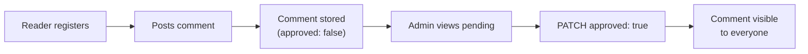
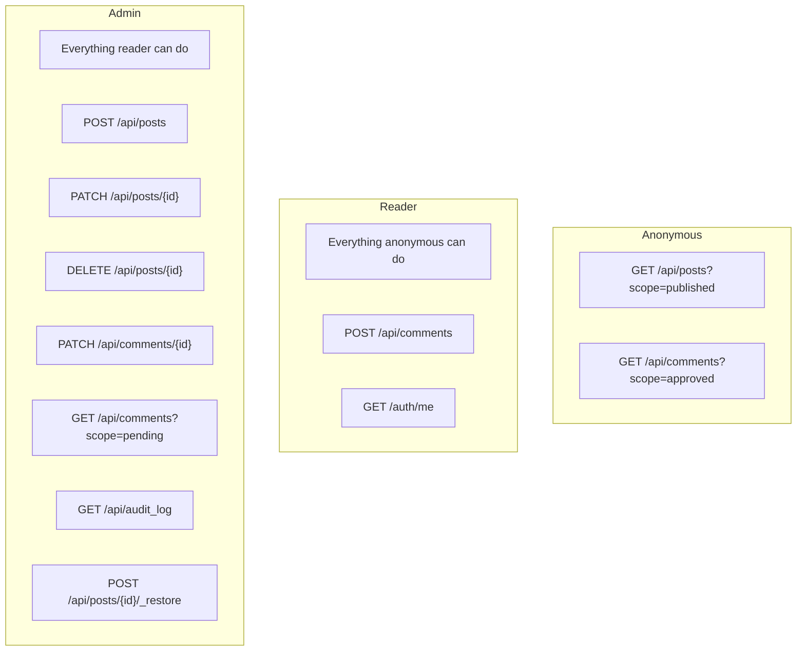

# Blog 101 — Building a Production Blog with Zero Code

A step-by-step guide to building **The Zero-Code Blog**: a fully functional
blog platform with public reading, authenticated comments, admin publishing,
comment moderation, audit trails, and computed fields — all from a single
`manifest.json` file.

---

## Table of Contents

1. [What We're Building](#1-what-were-building)
2. [Prerequisites](#2-prerequisites)
3. [Quick Start](#3-quick-start)
4. [The Manifest, Section by Section](#4-the-manifest-section-by-section)
5. [Access Control Model](#5-access-control-model)
6. [Data Flow Walkthroughs](#6-data-flow-walkthroughs)
7. [The Frontend](#7-the-frontend)
8. [Security Checklist](#8-security-checklist)
9. [Extending the Blog](#9-extending-the-blog)
10. [Appendix A — Full Manifest](#appendix-a--full-manifest)
11. [Appendix B — curl Command Reference](#appendix-b--curl-command-reference)
12. [Appendix C — Scopes Reference](#appendix-c--scopes-reference)
13. [Appendix D — Hooks Reference](#appendix-d--hooks-reference)

---

## 1. What We're Building

A production-grade blog with these capabilities:

- **Public blog feed** — anyone can read published posts, no login required
- **Authenticated comments** — readers register and leave comments
- **Comment moderation** — comments start as pending, admin approves them
- **Admin authoring** — admins write, edit, publish, archive, and trash posts
- **Soft delete** — deleted posts go to trash and can be restored
- **Live comment counts** — computed at read time, never stale
- **Automatic audit trail** — every create/update/delete logged via hooks
- **Auto-expiring audit logs** — TTL index cleans up entries after 90 days
- **Unique categories** — `x-unique` constraint prevents duplicates
- **Schema validation** — invalid documents rejected before they hit the DB

The entire backend is a single JSON file. No Python. No Express. No Django.

```
zero_code_api/
├── manifest.json        ← the entire API
├── public/
│   └── index.html       ← the blog frontend (auto-served at /)
├── docker-compose.yml   ← one-command setup
├── blog.md              ← architecture walkthrough
├── MDB_ENGINE_101.md    ← framework deep-dive
├── BLOG_101.md          ← this file
└── README.md
```

---

## 2. Prerequisites

**Option A — Docker (recommended):**

- Docker and Docker Compose

**Option B — Local:**

- Python >= 3.10
- MongoDB running locally (or a remote URI)
- `pip install mdb-engine uvicorn`

**Environment Variables:**

| Variable | Required | Purpose |
|---|---|---|
| `ADMIN_EMAIL` | Yes | Admin user email (resolved via `{{env.ADMIN_EMAIL}}`) |
| `ADMIN_PASSWORD` | Yes | Admin user password (resolved via `{{env.ADMIN_PASSWORD}}`) |
| `MDB_JWT_SECRET` | Production | JWT signing secret (>= 32 chars) |
| `MDB_ENGINE_MASTER_KEY` | Production | Master encryption key (>= 32 chars) |

---

## 3. Quick Start

### Docker

```bash
docker compose up
```

Override admin credentials:

```bash
ADMIN_EMAIL=me@corp.com ADMIN_PASSWORD=supersecret docker compose up
```

### Local

```bash
pip install mdb-engine uvicorn

ADMIN_EMAIL=admin@example.com ADMIN_PASSWORD=admin123 \
  mdb-engine serve manifest.json --reload
```

### CLI Admin Provisioning (No Secrets in Env)

```bash
mdb-engine add-user manifest.json --email admin@corp.com --role admin
# Password: ********
# Confirm: ********
# User admin@corp.com created with role 'admin'.
```

**Open the blog:** http://localhost:8000
**Swagger docs:** http://localhost:8000/docs

---

## 4. The Manifest, Section by Section

### 4.1 Top-Level Metadata

```json
{
  "schema_version": "2.0",
  "slug": "zero_code_blog",
  "name": "Zero-Code Blog"
}
```

- `schema_version` — manifest format version (always `"2.0"`)
- `slug` — unique app identifier, used for `app_id` scoping in MongoDB
- `name` — human-readable name shown in OpenAPI docs

### 4.2 Authentication

```json
{
  "auth": {
    "mode": "app",
    "users": {
      "enabled": true,
      "strategy": "app_users",
      "allow_registration": true,
      "registration_role": "reader",
      "max_login_attempts": 5,
      "login_lockout_seconds": 900,
      "session_cookie_name": "blog_session",
      "demo_users": [
        {
          "email": "{{env.ADMIN_EMAIL}}",
          "password": "{{env.ADMIN_PASSWORD}}",
          "role": "admin"
        }
      ]
    }
  }
}
```

**What each key does:**

| Key | Value | Effect |
|---|---|---|
| `enabled: true` | Turns on **secure-by-default** | Every endpoint requires auth unless `public_read` is set |
| `strategy: "app_users"` | Users stored in app's own collection | Independent from other apps |
| `allow_registration: true` | Public registration open | Anyone can create an account |
| `registration_role: "reader"` | New users get "reader" role | Cannot write posts (need "admin") |
| `max_login_attempts: 5` | Rate limit on login | 5 attempts per email per lockout period |
| `login_lockout_seconds: 900` | 15-minute lockout | After 5 failed attempts |
| `session_cookie_name` | Custom cookie name | Avoids collisions with other apps |
| `demo_users` | Seed admin at startup | `{{env.*}}` placeholders resolved from environment |

**Why `{{env.*}}`?** The manifest never contains plaintext credentials. The
engine resolves `{{env.ADMIN_EMAIL}}` from the `$ADMIN_EMAIL` environment
variable at startup. This means the manifest is safe to commit to version
control.

**Generated auth endpoints:**

| Method | Path | Description |
|---|---|---|
| POST | `/auth/register` | Create account (gets "reader" role) |
| POST | `/auth/login` | Authenticate, returns session cookie |
| POST | `/auth/logout` | End session |
| GET | `/auth/me` | Current session info (`{authenticated, user}`) |

### 4.3 Posts Collection

The posts collection is the heart of the blog. It showcases the most manifest
features in one place.

```json
"posts": {
  "auto_crud": true,
  "soft_delete": true,
  "auth": { "public_read": true, "write_roles": ["admin"] },
  "owner_field": "author_id",
  "immutable_fields": ["author_id"],
  "writable_fields": ["title", "body", "author", "status", "tags"],
  "schema": { ... },
  "defaults": { ... },
  "scopes": { ... },
  "pipelines": { ... },
  "hooks": { ... },
  "computed": { ... }
}
```

Let's break down each section:

#### Schema Validation

```json
"schema": {
  "type": "object",
  "properties": {
    "title":  { "type": "string" },
    "body":   { "type": "string" },
    "author": { "type": "string" },
    "status": { "type": "string", "enum": ["draft", "published", "archived"] },
    "tags":   { "type": "array", "items": { "type": "string" } }
  },
  "required": ["title"]
}
```

- `title` is required — POST without it returns 422
- `status` must be one of `draft`, `published`, `archived` — invalid values
  return 422
- `tags` must be an array of strings

#### Defaults

```json
"defaults": {
  "status": "draft",
  "tags": [],
  "author": "{{user.email}}"
}
```

Applied on create via `setdefault` — caller-provided values take precedence.

- `status` defaults to `"draft"` — new posts are not published unless the admin
  explicitly sets `"status": "published"`
- `tags` defaults to `[]` — avoids null arrays
- `author` auto-fills from the authenticated user's email

#### Scopes

```json
"scopes": {
  "published": { "status": "published" },
  "drafts":    { "status": "draft" },
  "archived":  { "status": "archived" }
}
```

Scopes are named MQL filters activated via the `?scope=` query parameter:

```bash
GET /api/posts?scope=published          # Only published posts
GET /api/posts?scope=drafts             # Only drafts
GET /api/posts?scope=archived           # Only archived
GET /api/posts?scope=published,drafts   # Published OR drafts (merged with $and)
GET /api/posts/_count?scope=published   # Count published posts
```

The frontend uses `?scope=published` for the public feed and cycles through
all scopes in the admin manage view.

#### Pipelines

```json
"pipelines": {
  "by_author": [
    { "$group": { "_id": "$author", "count": { "$sum": 1 } } },
    { "$sort": { "count": -1 } }
  ],
  "by_tag": [
    { "$unwind": "$tags" },
    { "$group": { "_id": "$tags", "count": { "$sum": 1 } } },
    { "$sort": { "count": -1 } }
  ]
}
```

Each pipeline becomes a GET endpoint:

```bash
GET /api/posts/_agg/by_author
# [{"_id": "admin@example.com", "count": 12}, ...]

GET /api/posts/_agg/by_tag
# [{"_id": "python", "count": 8}, {"_id": "mongodb", "count": 5}]
```

The engine auto-prepends an `app_id` `$match` stage, so pipelines never leak
data from other apps.

#### Hooks (Audit Trail)

```json
"hooks": {
  "after_create": [
    {
      "action": "insert",
      "collection": "audit_log",
      "document": {
        "event": "post_created",
        "entity": "posts",
        "entity_id": "{{doc._id}}",
        "actor": "{{user.email}}",
        "timestamp": "$$NOW"
      }
    }
  ],
  "after_update": [
    {
      "action": "insert",
      "collection": "audit_log",
      "document": {
        "event": "post_updated",
        "entity": "posts",
        "entity_id": "{{doc._id}}",
        "actor": "{{user.email}}",
        "timestamp": "$$NOW"
      }
    }
  ],
  "after_delete": [
    {
      "action": "insert",
      "collection": "audit_log",
      "document": {
        "event": "post_deleted",
        "entity": "posts",
        "entity_id": "{{doc._id}}",
        "actor": "{{user.email}}",
        "timestamp": "$$NOW"
      }
    }
  ]
}
```

Every write operation on posts automatically logs an audit entry. The
placeholders are resolved at runtime:

- `{{doc._id}}` — the ID of the document just created/updated/deleted
- `{{user.email}}` — the email of the user who performed the action
- `$$NOW` — the current UTC timestamp

Hooks are **fire-and-forget** — a hook failure never blocks the API response.
This means the audit trail is best-effort, but the write operation always
succeeds.

Hooks fire for every document in a bulk insert (`POST /api/posts/_bulk`),
ensuring the audit trail has no blind spots.

#### Computed Fields

```json
"computed": {
  "comment_count": {
    "pipeline": [
      {
        "$lookup": {
          "from": "comments",
          "let": { "pid": { "$toString": "$_id" } },
          "pipeline": [
            { "$match": { "$expr": { "$eq": ["$post_id", "$$pid"] } } }
          ],
          "as": "_comments"
        }
      },
      { "$addFields": { "comment_count": { "$size": "$_comments" } } },
      { "$project": { "_comments": 0 } }
    ]
  }
}
```

Activated via `?computed=comment_count`:

```bash
GET /api/posts?scope=published&computed=comment_count
```

Each post in the response includes a `comment_count` field computed live via
`$lookup` + `$size`. No denormalization, no stale counts, no background sync.

The frontend uses this to show comment counts on the blog feed.

#### Ownership and Field Protection

```json
"owner_field": "author_id",
"immutable_fields": ["author_id"],
"writable_fields": ["title", "body", "author", "status", "tags"]
```

- `owner_field` — the engine auto-injects the creator's user ID into
  `author_id` on create and generates implicit ownership policies
- `immutable_fields` — `author_id` cannot be changed after creation, even by
  the admin. Silently stripped from PATCH/PUT bodies.
- `writable_fields` — only these five fields can be set by clients. Any other
  field in a POST/PUT/PATCH body is silently stripped. This prevents injection
  of `internal_flag`, `admin_override`, or any undeclared field.

#### Soft Delete

```json
"soft_delete": true
```

When a post is deleted:

1. The document gets a `deleted_at` timestamp instead of being removed
2. The document disappears from normal `GET /api/posts` queries
3. The document appears in `GET /api/posts/_trash`
4. An admin can restore it via `POST /api/posts/{id}/_restore`

The frontend implements a full trash/restore workflow in the admin panel.

### 4.4 Comments Collection

```json
"comments": {
  "auto_crud": true,
  "owner_field": "user_id",
  "immutable_fields": ["post_id", "user_id"],
  "auth": {
    "public_read": true,
    "create_required": true,
    "write_roles": ["admin"]
  },
  "schema": {
    "type": "object",
    "properties": {
      "post_id":  { "type": "string" },
      "user_id":  { "type": "string" },
      "author":   { "type": "string" },
      "body":     { "type": "string" },
      "approved": { "type": "boolean" }
    },
    "required": ["post_id", "body"]
  },
  "defaults": {
    "approved": false,
    "author": "{{user.email}}"
  },
  "scopes": {
    "approved": { "approved": true },
    "pending": {
      "filter": { "approved": false },
      "auth": { "roles": ["admin"] }
    }
  },
  "relations": {
    "post": {
      "from": "posts",
      "local_field": "post_id",
      "foreign_field": "_id",
      "single": true
    }
  },
  "hooks": {
    "after_create": [
      {
        "action": "insert",
        "collection": "audit_log",
        "document": {
          "event": "comment_created",
          "entity": "comments",
          "entity_id": "{{doc._id}}",
          "actor": "{{user.email}}",
          "timestamp": "$$NOW"
        }
      }
    ]
  }
}
```

**Key design decisions:**

| Feature | Config | Effect |
|---|---|---|
| **Moderation gate** | `defaults.approved: false` | New comments are not visible to the public |
| **Auth for creation** | `create_required: true` | Must be logged in to comment (any role) |
| **Admin moderation** | `write_roles: ["admin"]` | Only admin can PATCH `approved: true` |
| **Public reading** | `public_read: true` | Anyone can see approved comments |
| **Admin-only pending** | `scopes.pending.auth.roles: ["admin"]` | Only admin can query `?scope=pending` |
| **Immutable link** | `immutable_fields: ["post_id"]` | Cannot reassign a comment to a different post |
| **Relation** | `relations.post` | `?populate=post` includes the full post object |

The comment moderation workflow:



### 4.5 Categories Collection

```json
"categories": {
  "auto_crud": true,
  "auth": { "write_roles": ["admin"] },
  "schema": {
    "type": "object",
    "properties": {
      "name":        { "type": "string", "x-unique": true },
      "description": { "type": "string" }
    },
    "required": ["name"]
  }
}
```

The `x-unique: true` extension on the `name` field:

1. Auto-creates a unique index at startup
2. Returns `409 Conflict` on duplicate names
3. Works with the standard JSON Schema validator

```bash
curl -X POST http://localhost:8000/api/categories \
  -H "Content-Type: application/json" -d '{"name":"Tech"}'
# → 201 Created

curl -X POST http://localhost:8000/api/categories \
  -H "Content-Type: application/json" -d '{"name":"Tech"}'
# → 409 {"detail": "Duplicate value for unique field(s): name"}
```

### 4.6 Audit Log Collection

```json
"audit_log": {
  "auto_crud": true,
  "read_only": true,
  "timestamps": false,
  "ttl": {
    "field": "timestamp",
    "expire_after": "90d"
  }
}
```

This collection is never written to by clients — it is populated exclusively
by hooks from other collections.

| Config | Effect |
|---|---|
| `read_only: true` | POST, PUT, PATCH, DELETE return 405 |
| `timestamps: false` | No `created_at`/`updated_at` — uses hook-injected `timestamp` |
| `ttl.expire_after: "90d"` | MongoDB auto-deletes documents older than 90 days |

The TTL index is created automatically by the engine at startup. No cron jobs,
no cleanup code, no maintenance.

---

## 5. Access Control Model

The blog has three tiers of access, all configured through the manifest:

| Role | Read Posts | Read Comments | Create Comments | Approve Comments | Write Posts | Manage |
|---|---|---|---|---|---|---|
| **Anonymous** | Yes (`public_read`) | Yes (approved only) | No | No | No | No |
| **Reader** | Yes | Yes (approved only) | Yes (pending approval) | No | No | No |
| **Admin** | Yes | Yes (all + pending) | Yes (auto-approved OK) | Yes | Yes | Yes |



### How It Works

1. `auth.users.enabled: true` makes **all endpoints require auth by default**
2. `public_read: true` on posts and comments **opts in to anonymous reads**
3. `create_required: true` on comments means **any authenticated user can POST**
4. `write_roles: ["admin"]` on posts and comments means **only admin can
   PUT/PATCH/DELETE**
5. The `pending` scope has `auth.roles: ["admin"]` so **only admin can query
   pending comments**
6. `registration_role: "reader"` means **self-registered users cannot write
   posts**

---

## 6. Data Flow Walkthroughs

### 6.1 Publishing a Post

Step-by-step with curl commands:

```bash
# 1. Login as admin
curl -s -c cookies -X POST http://localhost:8000/auth/login \
  -H "Content-Type: application/json" \
  -d '{"email":"admin@example.com","password":"admin123"}'
# → {"authenticated": true, "user": {"email": "admin@example.com", "role": "admin"}}
```

```bash
# 2. Create a published post
curl -s -b cookies -X POST http://localhost:8000/api/posts \
  -H "Content-Type: application/json" \
  -d '{
    "title": "Hello World",
    "body": "# Welcome\n\nThis is my first post on the **zero-code blog**.",
    "status": "published",
    "tags": ["intro", "mdb-engine"]
  }'
```

What happens server-side:

1. Auth middleware validates the session cookie → user is admin
2. `write_roles: ["admin"]` check passes
3. JSON Schema validates the body (title present, status is valid enum, tags is
   string array)
4. `writable_fields` strips any fields not in the allowlist
5. `defaults` applies: `author` ← `"admin@example.com"` (from `{{user.email}}`)
6. `owner_field` injects: `author_id` ← admin's `_id`
7. `timestamps` injects: `created_at`, `updated_at`
8. Document inserted into MongoDB (scoped by `app_id`)
9. `after_create` hook fires: inserts audit log entry with `{{doc._id}}`,
   `{{user.email}}`, `$$NOW`

```bash
# 3. Verify — anonymous reader sees the post
curl -s http://localhost:8000/api/posts?scope=published
# → {"data": [{"_id": "...", "title": "Hello World", "status": "published", ...}]}
```

### 6.2 Comment Moderation

```bash
# 1. Register a reader account
curl -s -c reader_cookies -X POST http://localhost:8000/auth/register \
  -H "Content-Type: application/json" \
  -d '{"email":"reader@example.com","password":"reader123"}'
# → user created with role "reader"
```

```bash
# 2. Post a comment (requires auth, any role)
curl -s -b reader_cookies -X POST http://localhost:8000/api/comments \
  -H "Content-Type: application/json" \
  -d '{"post_id":"<POST_ID>","body":"Great first post!"}'
# → 201 Created (approved: false by default)
```

```bash
# 3. Anonymous user checks — comment is NOT visible
curl -s "http://localhost:8000/api/comments?scope=approved&filter=post_id:<POST_ID>"
# → {"data": []}  (no approved comments yet)
```

```bash
# 4. Admin views pending comments
curl -s -b cookies "http://localhost:8000/api/comments?scope=pending"
# → {"data": [{"_id": "<COMMENT_ID>", "body": "Great first post!", "approved": false}]}
```

```bash
# 5. Admin approves the comment
curl -s -b cookies -X PATCH "http://localhost:8000/api/comments/<COMMENT_ID>" \
  -H "Content-Type: application/json" \
  -d '{"approved": true}'
# → {"data": {"approved": true, ...}}
```

```bash
# 6. Comment now visible to everyone
curl -s "http://localhost:8000/api/comments?scope=approved&filter=post_id:<POST_ID>"
# → {"data": [{"body": "Great first post!", "approved": true, ...}]}
```

### 6.3 Computed Comment Counts

```bash
# Request posts with live comment counts
curl -s "http://localhost:8000/api/posts?scope=published&computed=comment_count"
```

Response:

```json
{
  "data": [
    {
      "_id": "...",
      "title": "Hello World",
      "status": "published",
      "comment_count": 3,
      "created_at": "2025-03-15T10:30:00Z",
      "author": "admin@example.com",
      "tags": ["intro", "mdb-engine"]
    }
  ]
}
```

The `comment_count` is computed at query time via a `$lookup` aggregation.
No denormalization, no stale data, no background sync.

Without `?computed=comment_count`, the field is not present — you only pay
the aggregation cost when you ask for it.

### 6.4 Soft Delete and Restore

```bash
# Delete a post (as admin)
curl -s -b cookies -X DELETE "http://localhost:8000/api/posts/<POST_ID>"
# → post gets deleted_at timestamp, disappears from normal queries
```

```bash
# Post is gone from published feed
curl -s "http://localhost:8000/api/posts?scope=published"
# → the deleted post is not in the results
```

```bash
# Admin can see it in the trash
curl -s -b cookies "http://localhost:8000/api/posts/_trash"
# → {"data": [{"_id": "<POST_ID>", "deleted_at": "2025-03-15T...", ...}]}
```

```bash
# Restore it
curl -s -b cookies -X POST "http://localhost:8000/api/posts/<POST_ID>/_restore" \
  -H "Content-Type: application/json" -d '{}'
# → post is back, deleted_at removed
```

### 6.5 Audit Trail Inspection

```bash
# View recent audit entries (as admin)
curl -s -b cookies "http://localhost:8000/api/audit_log?sort=-timestamp&limit=10"
```

Response:

```json
{
  "data": [
    {
      "event": "post_created",
      "entity": "posts",
      "entity_id": "...",
      "actor": "admin@example.com",
      "timestamp": "2025-03-15T10:30:00Z"
    },
    {
      "event": "comment_created",
      "entity": "comments",
      "entity_id": "...",
      "actor": "reader@example.com",
      "timestamp": "2025-03-15T10:35:00Z"
    }
  ]
}
```

The audit log is:
- **Read-only** — no one can POST/PATCH/DELETE entries via the API
- **TTL-indexed** — MongoDB auto-deletes entries older than 90 days
- **Hook-populated** — entries come from `after_create`/`after_update`/
  `after_delete` hooks on posts and comments

### 6.6 Relations (Populate)

```bash
# Get comments with their parent post embedded
curl -s "http://localhost:8000/api/comments?scope=approved&populate=post"
```

Response:

```json
{
  "data": [
    {
      "_id": "...",
      "body": "Great first post!",
      "approved": true,
      "post": {
        "_id": "...",
        "title": "Hello World",
        "body": "# Welcome\n\nThis is my first post...",
        "status": "published"
      }
    }
  ]
}
```

The `post` field is injected at read time via `$lookup`. The relation is
defined in the manifest:

```json
"relations": {
  "post": {
    "from": "posts",
    "local_field": "post_id",
    "foreign_field": "_id",
    "single": true
  }
}
```

### 6.7 Aggregation Pipelines

```bash
# Posts grouped by author
curl -s -b cookies "http://localhost:8000/api/posts/_agg/by_author"
# → [{"_id": "admin@example.com", "count": 12}]
```

```bash
# Posts grouped by tag
curl -s -b cookies "http://localhost:8000/api/posts/_agg/by_tag"
# → [{"_id": "python", "count": 8}, {"_id": "mongodb", "count": 5}]
```

---

## 7. The Frontend

The blog frontend is a single `public/index.html` file (138 lines). It is
auto-served at `/` by `mdb-engine serve` — no CORS, no proxy, no build step.

### Architecture

The frontend is a vanilla JavaScript SPA with four views:

| View | Who Sees It | What It Shows |
|---|---|---|
| **Feed** | Everyone | Published posts with comment counts |
| **Article** | Everyone | Single post with Markdown rendering and comments |
| **Compose** | Admin only | Markdown editor with live preview |
| **Manage** | Admin only | Stats, post management, comment moderation, audit log |

### How Auth Works in the Frontend

```
Boot → GET /auth/me → {authenticated: false}
                     → Show "Sign in" / "Register" buttons

User clicks "Sign in" → POST /auth/login → session cookie set
                       → GET /auth/me → {authenticated: true, user: {role: "admin"}}
                       → Show admin views
```

The frontend stores session state from `/auth/me` and uses it to:
- Show/hide admin-only navigation buttons
- Show/hide comment composer (requires auth)
- Gate the compose and manage views

### Same-Origin API Calls

Because `mdb-engine serve` serves both the frontend and the API on the same
origin, all API calls use relative paths:

```javascript
const BASE = location.origin;
const r = await fetch(BASE + '/api/posts?scope=published');
```

No CORS headers needed. Session cookies flow automatically.

### Markdown Rendering

The frontend includes a minimal Markdown renderer (`md()` function) that
handles headings, bold, italic, code, code blocks, blockquotes, links, and
lists. The live preview in the compose view updates on every keystroke.

### View Switching

Navigation is handled by the `go(view)` function, which:
1. Checks auth (redirects to login if admin view requested by non-admin)
2. Toggles CSS classes to show/hide views
3. Loads data for the active view (feed, stats, manage list, etc.)

---

## 8. Security Checklist

Every feature below is enforced by the engine. None of it is custom code.

| Security Feature | How It Works |
|---|---|
| **Secure-by-default** | `auth.users.enabled: true` → all endpoints require auth. No accidental exposure. |
| **Users collection blocked** | The `users` collection (passwords, hashes) is never exposed via auto-CRUD. |
| **Protected fields** | `role`, `password`, `password_hash`, `is_admin` are auto-immutable on every collection. |
| **Sensitive fields hidden** | `password` and `password_hash` excluded from GET responses. |
| **Writable fields allowlist** | Only declared fields accepted in POST/PUT/PATCH. Everything else stripped. |
| **Immutable fields** | `author_id`, `post_id`, `user_id` cannot change after creation. |
| **Login rate limiting** | 5 attempts per email per 15 minutes. Returns 429 + `Retry-After`. |
| **Registration rate limiting** | 5 accounts per IP per hour. Returns 429. |
| **Request body size limit** | 1 MB default. Prevents memory exhaustion. |
| **No plaintext secrets** | `{{env.*}}` in `demo_users` — manifest is safe to commit. |
| **Privilege escalation blocked** | Client cannot PATCH `{"role": "admin"}` — field is auto-stripped. |
| **Ownership enforced** | `owner_field` generates write/delete policies. Non-owners cannot modify. |
| **Restore policy enforced** | Soft-delete `_restore` respects ownership policies. |
| **Schema validation** | Invalid documents rejected before hitting the database. |
| **Enum validation** | Invalid status values rejected (422). |
| **Unique constraints** | `x-unique` prevents duplicate category names (409). |

---

## 9. Extending the Blog

All extensions below can be done by editing `manifest.json` — no Python code
needed.

### Add a "Featured" Scope

Show only featured posts on the homepage:

```json
"scopes": {
  "published": { "status": "published" },
  "featured": { "status": "published", "featured": true }
}
```

```bash
GET /api/posts?scope=featured
```

### Add Full-Text Search (Scope with Regex)

Simple text search via scope:

```json
"scopes": {
  "search": { "title": { "$regex": "{{query}}", "$options": "i" } }
}
```

Or use MongoDB Atlas Search with a pipeline.

### Add a "Popular Posts" Pipeline

```json
"pipelines": {
  "popular": [
    { "$lookup": {
      "from": "comments",
      "let": { "pid": { "$toString": "$_id" } },
      "pipeline": [
        { "$match": { "$expr": { "$eq": ["$post_id", "$$pid"] } } }
      ],
      "as": "_comments"
    }},
    { "$addFields": { "comment_count": { "$size": "$_comments" } } },
    { "$sort": { "comment_count": -1 } },
    { "$limit": 10 },
    { "$project": { "_comments": 0 } }
  ]
}
```

```bash
GET /api/posts/_agg/popular
```

### Link Posts to Categories

Add a `category_id` field to posts and a relation:

```json
"posts": {
  "schema": {
    "properties": {
      "category_id": { "type": "string" }
    }
  },
  "relations": {
    "category": {
      "from": "categories",
      "local_field": "category_id",
      "foreign_field": "_id",
      "single": true
    }
  }
}
```

```bash
GET /api/posts?scope=published&populate=category
```

### Add Invite-Only Registration

```json
"users": {
  "allow_registration": "invite_only",
  "invite_codes": ["{{env.INVITE_CODE}}", "beta-tester-2025"]
}
```

### Add Realtime Updates

```json
"posts": {
  "realtime": true
}
```

WebSocket clients receive Change Stream events when posts are created, updated,
or deleted.

---

## Appendix A — Full Manifest

The complete `manifest.json` for the Zero-Code Blog:

```json
{
  "schema_version": "2.0",
  "slug": "zero_code_blog",
  "name": "Zero-Code Blog",
  "auth": {
    "mode": "app",
    "users": {
      "enabled": true,
      "strategy": "app_users",
      "allow_registration": true,
      "registration_role": "reader",
      "max_login_attempts": 5,
      "login_lockout_seconds": 900,
      "session_cookie_name": "blog_session",
      "demo_users": [
        {
          "email": "{{env.ADMIN_EMAIL}}",
          "password": "{{env.ADMIN_PASSWORD}}",
          "role": "admin"
        }
      ]
    }
  },
  "collections": {
    "posts": {
      "auto_crud": true,
      "soft_delete": true,
      "auth": { "public_read": true, "write_roles": ["admin"] },
      "owner_field": "author_id",
      "immutable_fields": ["author_id"],
      "writable_fields": ["title", "body", "author", "status", "tags"],
      "schema": {
        "type": "object",
        "properties": {
          "title":  { "type": "string" },
          "body":   { "type": "string" },
          "author": { "type": "string" },
          "status": { "type": "string", "enum": ["draft", "published", "archived"] },
          "tags":   { "type": "array", "items": { "type": "string" } }
        },
        "required": ["title"]
      },
      "defaults": {
        "status": "draft",
        "tags": [],
        "author": "{{user.email}}"
      },
      "scopes": {
        "published": { "status": "published" },
        "drafts":    { "status": "draft" },
        "archived":  { "status": "archived" }
      },
      "pipelines": {
        "by_author": [
          { "$group": { "_id": "$author", "count": { "$sum": 1 } } },
          { "$sort": { "count": -1 } }
        ],
        "by_tag": [
          { "$unwind": "$tags" },
          { "$group": { "_id": "$tags", "count": { "$sum": 1 } } },
          { "$sort": { "count": -1 } }
        ]
      },
      "hooks": {
        "after_create": [
          { "action": "insert", "collection": "audit_log", "document": {
            "event": "post_created", "entity": "posts", "entity_id": "{{doc._id}}", "actor": "{{user.email}}", "timestamp": "$$NOW"
          }}
        ],
        "after_update": [
          { "action": "insert", "collection": "audit_log", "document": {
            "event": "post_updated", "entity": "posts", "entity_id": "{{doc._id}}", "actor": "{{user.email}}", "timestamp": "$$NOW"
          }}
        ],
        "after_delete": [
          { "action": "insert", "collection": "audit_log", "document": {
            "event": "post_deleted", "entity": "posts", "entity_id": "{{doc._id}}", "actor": "{{user.email}}", "timestamp": "$$NOW"
          }}
        ]
      },
      "computed": {
        "comment_count": {
          "pipeline": [
            { "$lookup": {
              "from": "comments",
              "let": { "pid": { "$toString": "$_id" } },
              "pipeline": [
                { "$match": { "$expr": { "$eq": ["$post_id", "$$pid"] } } }
              ],
              "as": "_comments"
            }},
            { "$addFields": { "comment_count": { "$size": "$_comments" } } },
            { "$project": { "_comments": 0 } }
          ]
        }
      }
    },
    "comments": {
      "auto_crud": true,
      "owner_field": "user_id",
      "immutable_fields": ["post_id", "user_id"],
      "auth": {
        "public_read": true,
        "create_required": true,
        "write_roles": ["admin"]
      },
      "schema": {
        "type": "object",
        "properties": {
          "post_id":  { "type": "string" },
          "user_id":  { "type": "string" },
          "author":   { "type": "string" },
          "body":     { "type": "string" },
          "approved": { "type": "boolean" }
        },
        "required": ["post_id", "body"]
      },
      "defaults": {
        "approved": false,
        "author": "{{user.email}}"
      },
      "scopes": {
        "approved": { "approved": true },
        "pending": {
          "filter": { "approved": false },
          "auth": { "roles": ["admin"] }
        }
      },
      "relations": {
        "post": { "from": "posts", "local_field": "post_id", "foreign_field": "_id", "single": true }
      },
      "hooks": {
        "after_create": [
          { "action": "insert", "collection": "audit_log", "document": {
            "event": "comment_created", "entity": "comments", "entity_id": "{{doc._id}}", "actor": "{{user.email}}", "timestamp": "$$NOW"
          }}
        ]
      }
    },
    "categories": {
      "auto_crud": true,
      "auth": { "write_roles": ["admin"] },
      "schema": {
        "type": "object",
        "properties": {
          "name":        { "type": "string", "x-unique": true },
          "description": { "type": "string" }
        },
        "required": ["name"]
      }
    },
    "audit_log": {
      "auto_crud": true,
      "read_only": true,
      "timestamps": false,
      "ttl": { "field": "timestamp", "expire_after": "90d" }
    }
  }
}
```

---

## Appendix B — curl Command Reference

All commands assume the server is running at `http://localhost:8000`.

### Authentication

```bash
# Login as admin
curl -s -c cookies -X POST http://localhost:8000/auth/login \
  -H "Content-Type: application/json" \
  -d '{"email":"admin@example.com","password":"admin123"}'

# Register a reader
curl -s -c reader -X POST http://localhost:8000/auth/register \
  -H "Content-Type: application/json" \
  -d '{"email":"reader@example.com","password":"reader123"}'

# Check session
curl -s -b cookies http://localhost:8000/auth/me

# Logout
curl -s -b cookies -X POST http://localhost:8000/auth/logout \
  -H "Content-Type: application/json" -d '{}'
```

### Posts

```bash
# List published posts (no auth needed)
curl -s "http://localhost:8000/api/posts?scope=published"

# List published posts with comment counts
curl -s "http://localhost:8000/api/posts?scope=published&computed=comment_count"

# List published posts sorted by newest first
curl -s "http://localhost:8000/api/posts?scope=published&sort=-created_at"

# Count published posts
curl -s "http://localhost:8000/api/posts/_count?scope=published"

# Get a single post
curl -s "http://localhost:8000/api/posts/<POST_ID>"

# Create a post (admin only)
curl -s -b cookies -X POST http://localhost:8000/api/posts \
  -H "Content-Type: application/json" \
  -d '{"title":"My Post","body":"# Hello\nWorld","status":"published","tags":["hello"]}'

# Update a post (admin only)
curl -s -b cookies -X PATCH "http://localhost:8000/api/posts/<POST_ID>" \
  -H "Content-Type: application/json" \
  -d '{"status":"archived"}'

# Delete a post (soft delete, admin only)
curl -s -b cookies -X DELETE "http://localhost:8000/api/posts/<POST_ID>"

# List trash
curl -s -b cookies "http://localhost:8000/api/posts/_trash"

# Restore from trash
curl -s -b cookies -X POST "http://localhost:8000/api/posts/<POST_ID>/_restore" \
  -H "Content-Type: application/json" -d '{}'

# Pipeline: posts by author
curl -s -b cookies "http://localhost:8000/api/posts/_agg/by_author"

# Pipeline: posts by tag
curl -s -b cookies "http://localhost:8000/api/posts/_agg/by_tag"

# Bulk create posts (admin only)
curl -s -b cookies -X POST http://localhost:8000/api/posts/_bulk \
  -H "Content-Type: application/json" \
  -d '[{"title":"Post 1","status":"draft"},{"title":"Post 2","status":"draft"}]'
```

### Comments

```bash
# List approved comments for a post (no auth needed)
curl -s "http://localhost:8000/api/comments?filter=post_id:<POST_ID>&scope=approved"

# List approved comments with post populated
curl -s "http://localhost:8000/api/comments?scope=approved&populate=post"

# Post a comment (authenticated user)
curl -s -b reader -X POST http://localhost:8000/api/comments \
  -H "Content-Type: application/json" \
  -d '{"post_id":"<POST_ID>","body":"Great post!"}'

# List pending comments (admin only)
curl -s -b cookies "http://localhost:8000/api/comments?scope=pending"

# Approve a comment (admin only)
curl -s -b cookies -X PATCH "http://localhost:8000/api/comments/<COMMENT_ID>" \
  -H "Content-Type: application/json" \
  -d '{"approved":true}'
```

### Categories

```bash
# List categories
curl -s -b cookies "http://localhost:8000/api/categories"

# Create a category (admin only)
curl -s -b cookies -X POST http://localhost:8000/api/categories \
  -H "Content-Type: application/json" \
  -d '{"name":"Technology","description":"Posts about tech"}'

# Attempt duplicate (returns 409)
curl -s -b cookies -X POST http://localhost:8000/api/categories \
  -H "Content-Type: application/json" \
  -d '{"name":"Technology"}'
```

### Audit Log

```bash
# View recent audit entries (requires auth)
curl -s -b cookies "http://localhost:8000/api/audit_log?sort=-timestamp&limit=10"

# Attempt to write (returns 405)
curl -s -b cookies -X POST http://localhost:8000/api/audit_log \
  -H "Content-Type: application/json" \
  -d '{"event":"nope"}'
```

### Query Parameters

```bash
# Filtering
curl -s "http://localhost:8000/api/posts?status=published"
curl -s "http://localhost:8000/api/posts?tags=in:python,go"

# Sorting
curl -s "http://localhost:8000/api/posts?sort=-created_at,title"

# Pagination
curl -s "http://localhost:8000/api/posts?limit=10&skip=20"

# Field selection
curl -s "http://localhost:8000/api/posts?fields=title,status,created_at"

# Combined
curl -s "http://localhost:8000/api/posts?scope=published&sort=-created_at&limit=5&fields=title,author&computed=comment_count"
```

---

## Appendix C — Scopes Reference

### Posts Scopes

| Scope Name | MQL Filter | Auth Required | Description |
|---|---|---|---|
| `published` | `{"status": "published"}` | No (`public_read`) | Published posts visible to everyone |
| `drafts` | `{"status": "draft"}` | Yes (any auth) | Draft posts |
| `archived` | `{"status": "archived"}` | Yes (any auth) | Archived posts |

### Comments Scopes

| Scope Name | MQL Filter | Auth Required | Description |
|---|---|---|---|
| `approved` | `{"approved": true}` | No (`public_read`) | Approved comments visible to everyone |
| `pending` | `{"approved": false}` | Admin only | Unapproved comments awaiting moderation |

### Scope Composition

Scopes can be combined with comma separation. Multiple scopes are merged with
`$and`:

```bash
# Posts that are published AND have a specific tag
GET /api/posts?scope=published&tags=python

# Multiple scopes (merged with $and)
GET /api/posts?scope=published,drafts
# Equivalent to: {$and: [{status: "published"}, {status: "draft"}]}
# (This particular combination returns nothing — use it for overlapping filters)
```

Scopes stack with URL query filters:

```bash
GET /api/posts?scope=published&author=admin@example.com
# → {$and: [{status: "published"}, {author: "admin@example.com"}]}
```

---

## Appendix D — Hooks Reference

### Hook Events

| Event | Fires When | Available Placeholders |
|---|---|---|
| `after_create` | After a document is inserted | `{{doc.*}}`, `{{user.*}}`, `$$NOW` |
| `after_update` | After a document is updated (PUT/PATCH) | `{{doc.*}}`, `{{user.*}}`, `$$NOW` |
| `after_delete` | After a document is deleted (or soft-deleted) | `{{doc.*}}`, `{{user.*}}`, `$$NOW` |

### Hook Actions

| Action | Parameters | Description |
|---|---|---|
| `insert` | `collection`, `document` | Insert a new document into the target collection |
| `update` | `collection`, `filter`, `update` | Update documents matching filter |

### Template Resolution Examples

**Input (manifest):**

```json
{
  "event": "post_created",
  "entity_id": "{{doc._id}}",
  "actor": "{{user.email}}",
  "timestamp": "$$NOW"
}
```

**Context at runtime:**

```json
{
  "doc": { "_id": "507f1f77bcf86cd799439011", "title": "Hello World" },
  "user": { "_id": "user123", "email": "admin@example.com", "role": "admin" }
}
```

**Resolved output (inserted into audit_log):**

```json
{
  "event": "post_created",
  "entity_id": "507f1f77bcf86cd799439011",
  "actor": "admin@example.com",
  "timestamp": "2025-03-15T10:30:00.000Z"
}
```

### Hook Execution Rules

1. **Fire-and-forget** — a hook failure never blocks the API response. The
   write operation always succeeds.
2. **Per-document in bulk** — hooks fire for every document in a
   `POST /_bulk` request.
3. **Resolved lazily** — `{{doc.*}}` is resolved after the write completes, so
   `{{doc._id}}` contains the actual inserted/updated document ID.
4. **No cascading** — a hook that inserts into `audit_log` does not trigger
   `audit_log`'s own hooks (audit_log has no hooks defined).
5. **Scoped by app** — hook inserts go through `ScopedCollectionWrapper`, so
   `app_id` is automatically injected.

### All Hooks in the Blog Manifest

| Collection | Event | Inserts Into | Document |
|---|---|---|---|
| `posts` | `after_create` | `audit_log` | `{event: "post_created", entity: "posts", entity_id, actor, timestamp}` |
| `posts` | `after_update` | `audit_log` | `{event: "post_updated", entity: "posts", entity_id, actor, timestamp}` |
| `posts` | `after_delete` | `audit_log` | `{event: "post_deleted", entity: "posts", entity_id, actor, timestamp}` |
| `comments` | `after_create` | `audit_log` | `{event: "comment_created", entity: "comments", entity_id, actor, timestamp}` |

---

*See also: [MDB_ENGINE_101.md](MDB_ENGINE_101.md) for the framework deep-dive,
[blog.md](blog.md) for the architecture walkthrough.*
