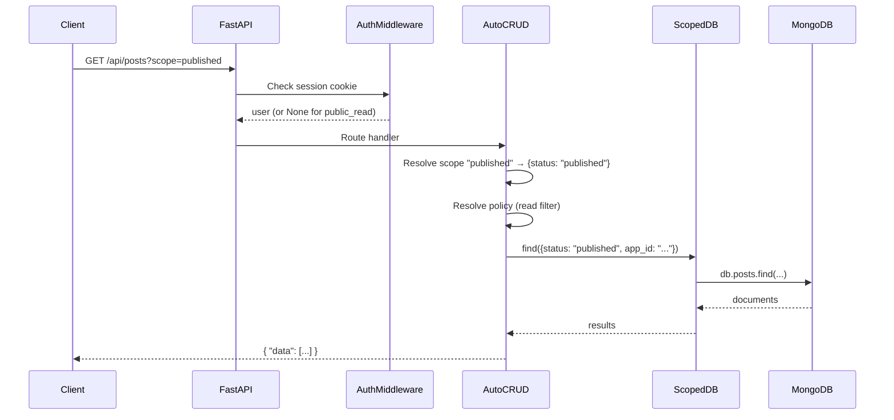

# MDB-Engine 101

A comprehensive guide to **mdb-engine** — the batteries-included MongoDB runtime
for Python. Learn how a single JSON manifest replaces thousands of lines of
backend boilerplate.

---

## Table of Contents

1. [What Is mdb-engine?](#1-what-is-mdb-engine)
2. [Architecture](#2-architecture)
3. [The Three Tiers](#3-the-three-tiers)
4. [Manifest-Driven Development](#4-manifest-driven-development)
5. [Zero-Code Collections Deep Dive](#5-zero-code-collections-deep-dive)
6. [Template Placeholders](#6-template-placeholders)
7. [Authentication & Security](#7-authentication--security)
8. [Generated REST API](#8-generated-rest-api)
9. [CLI Tooling](#9-cli-tooling)
10. [The `public/` Convention](#10-the-public-convention)
11. [Beyond Zero-Code](#11-beyond-zero-code)
12. [Appendix A — Environment Variables](#appendix-a--environment-variables)
13. [Appendix B — Collection Config Keys](#appendix-b--collection-config-keys)
14. [Appendix C — Generated Endpoints](#appendix-c--generated-endpoints)
15. [Appendix D — Annotated Manifest](#appendix-d--annotated-manifest)

---

## 1. What Is mdb-engine?

**mdb-engine** is a Python framework that turns a JSON manifest into a
production-grade REST API backed by MongoDB. It wraps FastAPI, Motor (async
MongoDB driver), and Pydantic V2 with:

- **Automatic data isolation** — every query is scoped by `app_id`
- **Manifest-driven configuration** — collections, auth, hooks, scopes,
  pipelines, and more declared in JSON
- **Optional AI services** — memory, embeddings, knowledge graphs, and
  ChatEngine available via `pip install mdb-engine[ai]`

### What It Replaces

| Traditional Stack | mdb-engine Equivalent |
|---|---|
| Django models + serializers + views + urls.py + admin | `manifest.json` collections with `auto_crud: true` |
| Express routes + Mongoose schemas + passport.js | `manifest.json` with `auth.users` + collection schemas |
| Rails models + controllers + migrations + routes.rb | `manifest.json` — no migrations needed (schemaless MongoDB) |
| Custom audit middleware | `hooks.after_create` / `after_update` / `after_delete` |
| Background cron for TTL cleanup | `ttl: { "field": "ts", "expire_after": "90d" }` |
| Manual RBAC middleware | `auth.write_roles`, `policy`, `owner_field` |

The design principle:

> **MQL is the DSL.** Every `scopes`, `pipelines`, `defaults`, `hooks`,
> `relations`, and `computed` value is a native MongoDB Query Language
> expression. The manifest speaks the same language as the database — no
> translation layer, no custom syntax. Declare what you want. The engine
> handles the rest.

---

## 2. Architecture

### How `mdb-engine serve` Works

```
mdb-engine serve manifest.json --reload
        │
        ▼
┌─────────────────────────┐
│  CLI (serve command)    │  Reads manifest, sets env vars,
│  cli/commands/serve.py  │  launches uvicorn
└────────┬────────────────┘
         │
         ▼
┌─────────────────────────┐
│  _serve_app.py          │  Creates MongoDBEngine instance,
│  (uvicorn entrypoint)   │  calls engine.create_app(slug, manifest)
└────────┬────────────────┘
         │
         ▼
┌─────────────────────────┐
│  MongoDBEngine          │  Connects to MongoDB, validates manifest,
│  core/fastapi_app.py    │  seeds demo users, creates indexes
└────────┬────────────────┘
         │
         ├──► mount_auto_crud_routes()    → REST endpoints for each collection
         ├──► setup auth middleware        → JWT sessions, CSRF, rate limiting
         ├──► mount /auth/* endpoints      → register, login, logout, me
         ├──► mount public/ static files   → index.html at /, assets at /public/
         └──► mount /docs                  → OpenAPI / Swagger UI
```

### Request Flow



Every query passes through `ScopedCollectionWrapper`, which automatically
injects the `app_id` filter. You never hardcode `app_id` — the framework
handles multi-tenancy transparently.

---

## 3. The Three Tiers

mdb-engine offers three levels of abstraction depending on how much control
you need.

### Tier 1 — Zero-config (`quickstart`)

Fastest path. One function call, one dependency.

```python
from mdb_engine import quickstart
from mdb_engine.dependencies import get_scoped_db
from fastapi import Depends

app = quickstart("my_app")

@app.get("/items")
async def list_items(db=Depends(get_scoped_db)):
    return await db.items.find({}).to_list(10)
```

Reads `MONGODB_URI` / `MDB_MONGO_URI` from environment (falls back to
`localhost:27017`). No manifest, no config files.

### Tier 2 — Manifest-based (`create_app`)

Full manifest power. Collections, auth, hooks, scopes — all in JSON.

```python
from pathlib import Path
from mdb_engine import MongoDBEngine

engine = MongoDBEngine(mongo_uri="mongodb://localhost:27017", db_name="mydb")
app = engine.create_app(slug="my_app", manifest=Path("manifest.json"))
```

This is what `mdb-engine serve` uses internally. The manifest defines
everything; Python code is optional.

### Tier 3 — Multi-app (`create_multi_app`)

Run multiple apps on a single engine with isolated data and optional SSO.

```python
app = engine.create_multi_app(
    apps=[
        {"slug": "blog", "manifest": Path("blog/manifest.json"), "path_prefix": "/blog"},
        {"slug": "store", "manifest": Path("store/manifest.json"), "path_prefix": "/store"},
    ],
    title="My Platform",
)
```

Each app gets its own `app_id` scope, collections, and auth config — but they
share a single MongoDB connection and can optionally share users via
`SharedUserPool`.

---

## 4. Manifest-Driven Development

The manifest is a JSON file that serves as the **single source of truth** for
your application. It replaces models, routes, middleware, migrations, and admin
config.

### Minimal Manifest

```json
{
  "schema_version": "2.0",
  "slug": "my_app",
  "name": "My Application"
}
```

This alone gives you a running FastAPI app with OpenAPI docs at `/docs`.

### Adding a Collection

```json
{
  "schema_version": "2.0",
  "slug": "my_app",
  "name": "My Application",
  "collections": {
    "tasks": {
      "auto_crud": true,
      "schema": {
        "type": "object",
        "properties": {
          "title": { "type": "string" },
          "status": { "type": "string", "enum": ["pending", "done"] }
        },
        "required": ["title"]
      }
    }
  }
}
```

This generates a complete REST API for `tasks`:

```
GET    /api/tasks          — list (filter, sort, paginate)
GET    /api/tasks/_count   — count
GET    /api/tasks/{id}     — get by ID
POST   /api/tasks          — create (with schema validation)
POST   /api/tasks/_bulk    — bulk create
PUT    /api/tasks/{id}     — full replace
PATCH  /api/tasks/{id}     — partial update
DELETE /api/tasks/{id}     — delete
```

No Python. No route definitions. No ORM. Just JSON.

### The Philosophy

Traditional web development follows a **code-first** approach: you write
models, then routes, then middleware, then tests, then migrations. Every feature
requires touching multiple files in multiple languages.

mdb-engine follows a **manifest-first** approach: you declare what you want in
JSON, and the engine generates the implementation. When you need custom
behavior, you drop into Python and use the framework's abstractions
(`RequestContext`, `UnitOfWork`, `Entity`).

The manifest speaks MQL — MongoDB Query Language. Scopes are MQL filters.
Pipelines are MQL aggregations. Defaults are MQL-compatible values. Hooks
resolve MQL-style templates. There is no proprietary DSL to learn. If you know
MongoDB, you know the manifest.

---

## 5. Zero-Code Collections Deep Dive

Every key in a collection config controls a specific behavior. Here is the
complete reference with examples.

### 5.1 `auto_crud`

**Type:** `boolean` | **Default:** `true`

When `true`, the engine generates all REST endpoints for this collection.
Set to `false` if you want to define custom routes only.

```json
{ "auto_crud": true }
```

### 5.2 `schema`

**Type:** `object` (JSON Schema)

Standard JSON Schema for document validation. Documents that fail validation
are rejected with 422. Supports the `x-unique` extension for unique constraints.

```json
{
  "schema": {
    "type": "object",
    "properties": {
      "title": { "type": "string" },
      "email": { "type": "string", "x-unique": true },
      "status": { "type": "string", "enum": ["active", "inactive"] }
    },
    "required": ["title", "email"]
  }
}
```

- `x-unique: true` auto-creates a unique index at startup. Duplicates return
  `409 Conflict`.
- `required` fields are validated on POST. Missing fields return 422.
- `enum` values are validated. Invalid values return 422.

### 5.3 `soft_delete`

**Type:** `boolean` | **Default:** `false`

When enabled, `DELETE` sets a `deleted_at` timestamp instead of removing the
document. Adds trash and restore endpoints.

```json
{ "soft_delete": true }
```

Extra endpoints generated:

| Method | Path | Description |
|---|---|---|
| GET | `/api/{name}/_trash` | List soft-deleted documents |
| POST | `/api/{name}/{id}/_restore` | Restore a soft-deleted document |

All normal `GET` queries automatically exclude soft-deleted documents.

### 5.4 `timestamps`

**Type:** `boolean` | **Default:** `true`

Automatically injects `created_at` (on create) and `updated_at` (on every
write). Set to `false` for collections like `audit_log` that manage their own
time fields.

```json
{ "timestamps": false }
```

### 5.5 `read_only`

**Type:** `boolean` | **Default:** `false`

Only generates GET endpoints. POST, PUT, PATCH, DELETE return `405 Method Not
Allowed`. Ideal for audit logs, analytics tables, or externally-populated data.

```json
{ "read_only": true }
```

### 5.6 `bulk_insert`

**Type:** `boolean` | **Default:** `true`

Enables `POST /api/{name}/_bulk` for batch inserts (up to 1000 documents).
Each document is validated individually. Hooks fire per document.

```json
{ "bulk_insert": true }
```

### 5.7 `defaults`

**Type:** `object`

Default values applied to new documents via `setdefault` — caller-provided
values always take precedence. Supports template placeholders.

```json
{
  "defaults": {
    "status": "draft",
    "tags": [],
    "author": "{{user.email}}",
    "owner_id": "{{user._id}}"
  }
}
```

- Static defaults: `"status": "draft"`, `"tags": []`
- User-derived defaults: `"author": "{{user.email}}"` resolves to the
  authenticated user's email at runtime
- If a placeholder like `{{user.email}}` is used and no user is authenticated,
  the request returns 401

### 5.8 `scopes`

**Type:** `object`

Named MQL filters activated via `?scope=name` query parameter. Two formats
supported:

**Plain filter:**

```json
{
  "scopes": {
    "published": { "status": "published" },
    "active": { "status": { "$ne": "archived" } },
    "recent": { "created_at": { "$gt": "$$NOW" } }
  }
}
```

**Extended (with auth):**

```json
{
  "scopes": {
    "pending": {
      "filter": { "approved": false },
      "auth": { "roles": ["admin"] }
    }
  }
}
```

The extended format lets you restrict who can activate a scope. The `pending`
scope above returns 403 unless the user has the `admin` role.

**Usage:**

```
GET /api/posts?scope=published          — single scope
GET /api/posts?scope=published,recent   — multiple scopes ($and-merged)
GET /api/posts/_count?scope=published   — count with scope
```

Unknown scope names return 400.

### 5.9 `pipelines`

**Type:** `object`

Named aggregation pipelines exposed as `GET /api/{name}/_agg/{pipeline_name}`.
The engine automatically prepends an `app_id` `$match` stage.

```json
{
  "pipelines": {
    "by_status": [
      { "$group": { "_id": "$status", "count": { "$sum": 1 } } },
      { "$sort": { "count": -1 } }
    ],
    "by_tag": [
      { "$unwind": "$tags" },
      { "$group": { "_id": "$tags", "count": { "$sum": 1 } } },
      { "$sort": { "count": -1 } }
    ]
  }
}
```

```bash
curl "http://localhost:8000/api/posts/_agg/by_status"
# [{"_id": "published", "count": 12}, {"_id": "draft", "count": 3}]

curl "http://localhost:8000/api/posts/_agg/by_tag"
# [{"_id": "python", "count": 8}, {"_id": "mongodb", "count": 5}]
```

### 5.10 `hooks`

**Type:** `object`

Lifecycle hooks that fire after write operations. Three events supported:
`after_create`, `after_update`, `after_delete`. Hooks are fire-and-forget —
a hook failure never blocks the response.

```json
{
  "hooks": {
    "after_create": [
      {
        "action": "insert",
        "collection": "audit_log",
        "document": {
          "event": "post_created",
          "entity": "posts",
          "entity_id": "{{doc._id}}",
          "actor": "{{user.email}}",
          "timestamp": "$$NOW"
        }
      }
    ],
    "after_update": [
      {
        "action": "insert",
        "collection": "audit_log",
        "document": {
          "event": "post_updated",
          "entity_id": "{{doc._id}}",
          "actor": "{{user.email}}",
          "timestamp": "$$NOW"
        }
      }
    ],
    "after_delete": [
      {
        "action": "insert",
        "collection": "audit_log",
        "document": {
          "event": "post_deleted",
          "entity_id": "{{doc._id}}",
          "actor": "{{user.email}}",
          "timestamp": "$$NOW"
        }
      }
    ]
  }
}
```

**Supported actions:**

| Action | What It Does |
|---|---|
| `insert` | Inserts a document into the target collection |
| `update` | Updates documents matching a filter in the target collection |

Hook documents support all template placeholders: `{{doc.*}}`, `{{user.*}}`,
`{{env.*}}`, and `$$NOW`.

Hooks fire for every document in a bulk insert, ensuring audit trails have no
blind spots.

### 5.11 `computed`

**Type:** `object`

Virtual fields computed at read time via aggregation pipelines. Activated with
`?computed=field_name` query parameter.

```json
{
  "computed": {
    "comment_count": {
      "pipeline": [
        {
          "$lookup": {
            "from": "comments",
            "let": { "pid": { "$toString": "$_id" } },
            "pipeline": [
              { "$match": { "$expr": { "$eq": ["$post_id", "$$pid"] } } }
            ],
            "as": "_comments"
          }
        },
        { "$addFields": { "comment_count": { "$size": "$_comments" } } },
        { "$project": { "_comments": 0 } }
      ]
    }
  }
}
```

```bash
curl "http://localhost:8000/api/posts?scope=published&computed=comment_count"
# Each post now has a "comment_count" field — computed live, never stale
```

No denormalization, no background sync, no stale counts. The aggregation runs
at query time.

### 5.12 `relations`

**Type:** `object`

Cross-collection joins populated at read time via `?populate=name`. Uses
MongoDB `$lookup` under the hood.

```json
{
  "relations": {
    "post": {
      "from": "posts",
      "local_field": "post_id",
      "foreign_field": "_id",
      "single": true
    }
  }
}
```

```bash
curl "http://localhost:8000/api/comments?scope=approved&populate=post"
```

```json
{
  "data": [{
    "_id": "...",
    "body": "Great post!",
    "post": {
      "_id": "...",
      "title": "Hello World",
      "body": "..."
    }
  }]
}
```

- `single: true` returns a single object (like MongoDB's `$unwind`)
- `single: false` (default) returns an array

### 5.13 `policy`

**Type:** `object`

Document-level access control via MQL filters. Applied automatically to every
query.

```json
{
  "policy": {
    "read":   { "team_id": "{{user.team_id}}" },
    "write":  { "owner_id": "{{user._id}}" },
    "delete": { "owner_id": "{{user._id}}" }
  }
}
```

- `read` — merged into every GET query
- `write` — merged into PUT/PATCH lookups
- `delete` — merged into DELETE lookups (falls back to `write` if omitted)

If a `{{user.*}}` placeholder is used and no user is authenticated, the
endpoint returns 401.

### 5.14 `owner_field`

**Type:** `string`

The field that stores the document creator's user ID. When set, the engine:

1. Auto-injects the creator's `_id` as a default on create
2. Generates implicit write/delete policies (owner can modify, admin bypasses)
3. Enforces ownership on restore (soft delete)

```json
{ "owner_field": "author_id" }
```

### 5.15 `immutable_fields`

**Type:** `array`

Fields that cannot be changed after creation. Silently stripped from PUT/PATCH
bodies.

```json
{ "immutable_fields": ["author_id", "post_id"] }
```

Even if a client sends `{"author_id": "hacked"}` in a PATCH, the engine strips
it silently. No error, no escalation path.

### 5.16 `writable_fields`

**Type:** `array`

Allowlist of fields that clients can write. Everything else is stripped. This is
an allowlist approach (safer than a denylist).

```json
{ "writable_fields": ["title", "body", "author", "status", "tags"] }
```

A client cannot inject `internal_flag`, `admin_override`, or any other
undeclared field.

### 5.17 `ttl`

**Type:** `object`

MongoDB TTL index for automatic document expiry. No cron jobs, no cleanup code.

```json
{
  "ttl": {
    "field": "timestamp",
    "expire_after": "90d"
  }
}
```

Supported duration formats: `"90d"` (days), `"24h"` (hours), `"3600s"`
(seconds), or an integer (seconds).

### 5.18 `max_body_bytes`

**Type:** `integer` | **Default:** `1048576` (1 MB)

Maximum request body size for write endpoints. Prevents memory exhaustion
attacks.

```json
{ "max_body_bytes": 524288 }
```

### 5.19 `default_projection`

**Type:** `object`

MongoDB projection applied to all reads when the client does not specify
`?fields=`. Use to hide internal fields.

```json
{
  "default_projection": { "internal_notes": 0, "audit_trail": 0 }
}
```

### 5.20 `auth` (per-collection)

**Type:** `object`

Per-collection authentication and authorization overrides.

```json
{
  "auth": {
    "public_read": true,
    "create_required": true,
    "write_roles": ["admin"],
    "required": false
  }
}
```

| Key | Effect |
|---|---|
| `public_read` | Anonymous users can GET. Writes still require auth. |
| `required` | All endpoints require authentication (default when app auth is enabled) |
| `create_required` | POST requires auth, but any role suffices |
| `write_roles` | PUT/PATCH/DELETE restricted to these roles |

---

## 6. Template Placeholders

The manifest supports four types of runtime placeholders, resolved by
`template_resolver.py`:

### `{{user.*}}`

Resolves to a value from the authenticated user object. Dot paths up to 3
levels deep.

| Placeholder | Resolves To |
|---|---|
| `{{user._id}}` | The user's `_id` field |
| `{{user.email}}` | The user's email |
| `{{user.role}}` | The user's role |
| `{{user.team_id}}` | Any top-level user field |
| `{{user.profile.org}}` | Nested path (max 3 levels) |

If the user is `None` (not authenticated), the engine returns **401**.

### `{{doc.*}}`

Resolves to a value from the document being created, updated, or deleted.
Used in hooks.

| Placeholder | Resolves To |
|---|---|
| `{{doc._id}}` | The document's `_id` (as string) |
| `{{doc.title}}` | Any field on the document |
| `{{doc.author.name}}` | Nested paths supported |

If the document is `None`, the placeholder is left as-is (no error).

### `{{env.*}}`

Resolves to an environment variable. Keys must match `^[A-Z_][A-Z0-9_]*$`.

| Placeholder | Resolves To |
|---|---|
| `{{env.ADMIN_EMAIL}}` | Value of `$ADMIN_EMAIL` |
| `{{env.ADMIN_PASSWORD}}` | Value of `$ADMIN_PASSWORD` |
| `{{env.INVITE_CODE}}` | Value of `$INVITE_CODE` |

If the environment variable is not set, the engine returns **400**.

### `$$NOW`

Resolves to the current UTC datetime (`datetime.now(timezone.utc)`).

```json
{ "timestamp": "$$NOW" }
```

### Resolution Context

| Placeholder | Available In |
|---|---|
| `{{user.*}}` | `defaults`, `scopes`, `policy`, `hooks`, `pipelines` |
| `{{doc.*}}` | `hooks` only (the document has been created/updated/deleted) |
| `{{env.*}}` | `demo_users`, `invite_codes` |
| `$$NOW` | `scopes`, `hooks`, `defaults` |

---

## 7. Authentication & Security

### Secure-by-Default

When `auth.users.enabled` is `true`, **every collection endpoint requires
authentication** — reads, writes, deletes, everything. You don't need to add
`"auth": {"required": true}` to each collection.

Per-collection `auth` can only *relax* access in one specific way:
`public_read: true` allows anonymous GETs. There is no way to make writes
public when app-level auth is on.

### Auth Configuration

```json
{
  "auth": {
    "mode": "app",
    "users": {
      "enabled": true,
      "strategy": "app_users",
      "allow_registration": true,
      "registration_role": "reader",
      "max_login_attempts": 5,
      "login_lockout_seconds": 900,
      "session_cookie_name": "blog_session",
      "demo_users": [
        {
          "email": "{{env.ADMIN_EMAIL}}",
          "password": "{{env.ADMIN_PASSWORD}}",
          "role": "admin"
        }
      ]
    }
  }
}
```

### Generated Auth Endpoints

| Method | Path | Description |
|---|---|---|
| POST | `/auth/register` | Create a new user (gets `registration_role`) |
| POST | `/auth/login` | Authenticate and receive session cookie |
| POST | `/auth/logout` | Clear session |
| GET | `/auth/me` | Current session info |

### Demo Users (Admin Seeding)

The `demo_users` array seeds users at startup. Supports `{{env.*}}`
placeholders so credentials never appear in the manifest file.

```json
"demo_users": [
  {
    "email": "{{env.ADMIN_EMAIL}}",
    "password": "{{env.ADMIN_PASSWORD}}",
    "role": "admin"
  }
]
```

Set environment variables:

```bash
export ADMIN_EMAIL=admin@example.com
export ADMIN_PASSWORD=supersecret
```

The engine resolves placeholders before hashing passwords and inserting users.
Users are only created if they don't already exist (idempotent).

### Automatic Security Features

| Feature | How It Works |
|---|---|
| **Users collection blocked** | The `users` collection is never exposed via auto-CRUD. Managed through `/auth/*` only. |
| **Protected fields** | `role`, `roles`, `password`, `password_hash`, `is_admin` are auto-immutable on every collection. |
| **Sensitive fields hidden** | `password` and `password_hash` are excluded from GET responses via `default_projection`. |
| **Writable fields allowlist** | `writable_fields` restricts which fields clients can write. Allowlist > denylist. |
| **Login rate limiting** | `max_login_attempts` (default 5) per email per 15 minutes. Returns 429 with `Retry-After`. |
| **Registration rate limiting** | 5 accounts per IP per hour. Returns 429. |
| **Request body size limit** | `max_body_bytes` (default 1 MB) per collection. |
| **Restore policy enforced** | Soft-delete `_restore` respects ownership policies. |
| **No plaintext secrets** | `{{env.*}}` in demo_users — never commit credentials. |

### Registration Modes

**Open registration:**

```json
{ "allow_registration": true, "registration_role": "reader" }
```

**Invite-only:**

```json
{
  "allow_registration": "invite_only",
  "invite_codes": ["{{env.INVITE_CODE}}", "beta-tester-2025"]
}
```

Clients include `"invite_code"` in the registration body. Codes support
`{{env.*}}` so they can be rotated without changing the manifest.

---

## 8. Generated REST API

### Endpoints Per Collection

For a collection named `tasks` with all features enabled:

| Method | Path | Description |
|---|---|---|
| GET | `/api/tasks` | List with filter, sort, paginate, scope, computed, populate |
| GET | `/api/tasks/_count` | Count with filter/scope support |
| GET | `/api/tasks/_trash` | List soft-deleted documents (if `soft_delete`) |
| GET | `/api/tasks/_agg/{name}` | Run a named aggregation pipeline |
| GET | `/api/tasks/{id}` | Get a single document by ID |
| POST | `/api/tasks` | Create (with defaults, schema validation, hooks) |
| POST | `/api/tasks/_bulk` | Bulk create up to 1000 documents |
| PUT | `/api/tasks/{id}` | Full replace |
| PATCH | `/api/tasks/{id}` | Partial update |
| DELETE | `/api/tasks/{id}` | Delete (or soft-delete) |
| POST | `/api/tasks/{id}/_restore` | Restore soft-deleted document |

### Query Parameters

All list endpoints (`GET /api/{name}`) support:

| Parameter | Example | Description |
|---|---|---|
| `scope` | `?scope=published` | Activate named scopes (comma-separated) |
| `computed` | `?computed=comment_count` | Include computed fields |
| `populate` | `?populate=post` | Populate relations |
| `sort` | `?sort=-created_at,title` | Sort (prefix `-` for descending) |
| `limit` | `?limit=10` | Max documents per page |
| `skip` | `?skip=20` | Skip N documents (pagination) |
| `fields` | `?fields=title,status` | Select specific fields (projection) |
| `filter` | `?status=published` | Field-level filter |
| | `?age=gt:18` | Comparison operator |
| | `?tags=in:python,go` | Set membership |

### Filter Operators

| Syntax | MongoDB Equivalent | Example |
|---|---|---|
| `field=value` | `{ field: value }` | `?status=active` |
| `field=gt:N` | `{ field: { $gt: N } }` | `?age=gt:18` |
| `field=gte:N` | `{ field: { $gte: N } }` | `?price=gte:10` |
| `field=lt:N` | `{ field: { $lt: N } }` | `?stock=lt:5` |
| `field=lte:N` | `{ field: { $lte: N } }` | `?rating=lte:3` |
| `field=ne:V` | `{ field: { $ne: V } }` | `?status=ne:deleted` |
| `field=in:a,b,c` | `{ field: { $in: [...] } }` | `?tags=in:python,go` |

---

## 9. CLI Tooling

### `mdb-engine serve`

Run a manifest as a live API server:

```bash
mdb-engine serve manifest.json --reload
mdb-engine serve manifest.json --host 0.0.0.0 --port 8080
mdb-engine serve manifest.json --mongo-uri mongodb://remote:27017 --db-name prod
```

Options:

| Flag | Default | Description |
|---|---|---|
| `--host` | `0.0.0.0` | Bind host |
| `--port` / `-p` | `8000` | Bind port |
| `--reload` | off | Auto-reload on file changes (dev mode) |
| `--mongo-uri` | `$MONGODB_URI` | MongoDB connection string |
| `--db-name` | `$MDB_DB_NAME` | Database name |

### `mdb-engine add-user`

Create users interactively (no secrets in files or env vars):

```bash
mdb-engine add-user manifest.json --email admin@corp.com --role admin
# Password: ********
# Confirm: ********
# User admin@corp.com created with role 'admin'.
```

### `mdb-engine validate`

Validate a manifest without starting the server:

```bash
mdb-engine validate manifest.json
```

### `mdb-engine new-app`

Scaffold a new mdb-engine project:

```bash
mdb-engine new-app my_project
```

### `mdb-engine doctor`

Diagnose common configuration issues:

```bash
mdb-engine doctor
```

---

## 10. The `public/` Convention

When using `mdb-engine serve`, the engine auto-detects a `public/` directory
next to the manifest and serves it:

- `public/index.html` is served at `/` (the root)
- All files in `public/` are available under `/public/`

```
my_app/
├── manifest.json
└── public/
    ├── index.html      ← served at /
    ├── styles.css       ← served at /public/styles.css
    └── app.js           ← served at /public/app.js
```

**Same-origin advantage:** Because the frontend and API run on the same origin,
there are no CORS issues. Your JavaScript can call `fetch("/api/posts")` with
no extra configuration. Session cookies work automatically.

This is inspired by Rails' `public/` directory convention. No build step, no
webpack, no proxy config. Just drop HTML files next to the manifest.

---

## 11. Beyond Zero-Code

Zero-code collections handle most CRUD APIs. When you need custom business
logic, mdb-engine provides Python-level abstractions:

### Custom Routes with RequestContext

```python
from mdb_engine.dependencies import RequestContext, get_request_context

@app.post("/api/publish/{post_id}")
async def publish(post_id: str, ctx: RequestContext = Depends(get_request_context)):
    ctx.require_role("editor")
    db = await ctx.get_db()
    await db.posts.update_one({"_id": post_id}, {"$set": {"status": "published"}})
    if ctx.memory:
        await ctx.memory.add(messages=f"Published post {post_id}", user_id=ctx.user["_id"])
    return {"ok": True}
```

`RequestContext` is the all-in-one dependency. It provides lazy access to
database, auth, memory, embeddings, LLM, and more.

### Repository Pattern

```python
from dataclasses import dataclass
from mdb_engine.repositories import Entity

@dataclass
class Invoice(Entity):
    customer_id: str = ""
    amount: float = 0.0
    status: str = "draft"
```

```python
from mdb_engine.dependencies import get_unit_of_work

@app.get("/invoices")
async def list_invoices(uow=Depends(get_unit_of_work)):
    return await uow.invoices.find({"status": "pending"}, limit=50)
```

`Entity` provides `id`, `created_at`, `updated_at` automatically. `UnitOfWork`
creates and caches typed repositories.

### Memory Service (AI)

```json
{ "memory_config": "smart" }
```

```python
from mdb_engine.dependencies import get_memory_service

@app.post("/remember")
async def remember(text: str, memory=Depends(get_memory_service)):
    return await memory.add(messages=text, user_id="user1")

@app.get("/recall")
async def recall(q: str, memory=Depends(get_memory_service)):
    return await memory.search(query=q, user_id="user1", limit=5)
```

Presets: `"basic"` (infer only), `"smart"` (cognitive + categories),
`"full"` (reflection, graph, emotion, conflict resolution).

### Knowledge Graph (GraphRAG)

```json
{
  "graph_config": { "node_types": ["person", "interest", "event"] },
  "graphrag_config": { "community_detection": { "enabled": true } }
}
```

```python
from mdb_engine.dependencies import get_graph_service

@app.post("/graph/extract")
async def extract(text: str, graph=Depends(get_graph_service)):
    return await graph.extract_graph_from_text(text, user_id="user1")
```

### Dependency Injection

```python
from mdb_engine.di import Container, Scope

container = Container()
container.register(MyService, scope=Scope.SINGLETON)
```

Scopes: `SINGLETON` (one per app), `REQUEST` (one per HTTP request),
`TRANSIENT` (new each time).

---

## Appendix A — Environment Variables

| Canonical Name | Deprecated Aliases | Purpose | Default |
|---|---|---|---|
| `MDB_MONGO_URI` | `MONGODB_URI`, `MONGO_URI` | MongoDB connection string | `mongodb://localhost:27017` |
| `MDB_DB_NAME` | `MONGODB_DB`, `MONGO_DB_NAME`, `DB_NAME` | Database name | `mdb_engine` |
| `MDB_JWT_SECRET` | `MDB_ENGINE_JWT_SECRET`, `SECRET_KEY` | JWT signing secret | — (required for auth) |
| `MDB_ENGINE_MASTER_KEY` | — | Master encryption key | — (required for app auth) |
| `OPENAI_API_KEY` | — | OpenAI API key (memory/LLM) | — |
| `AZURE_OPENAI_API_KEY` | — | Azure OpenAI key | — |
| `AZURE_OPENAI_ENDPOINT` | — | Azure OpenAI endpoint | — |
| `AZURE_OPENAI_DEPLOYMENT_NAME` | — | Azure deployment name | `gpt-4o` |
| `OPENAI_MODEL` | — | OpenAI model name | `gpt-4o` |
| `ADMIN_EMAIL` | — | Admin email (for `{{env.ADMIN_EMAIL}}`) | — |
| `ADMIN_PASSWORD` | — | Admin password (for `{{env.ADMIN_PASSWORD}}`) | — |

---

## Appendix B — Collection Config Keys

| Key | Type | Default | Description |
|---|---|---|---|
| `auto_crud` | boolean | `true` | Generate REST endpoints |
| `schema` | object | — | JSON Schema for document validation |
| `read_only` | boolean | `false` | GET endpoints only |
| `timestamps` | boolean | `true` | Auto-inject `created_at` / `updated_at` |
| `soft_delete` | boolean | `false` | Soft delete with trash/restore |
| `bulk_insert` | boolean | `true` | Enable `POST /_bulk` |
| `auth` | object | — | Per-collection auth (`public_read`, `required`, `roles`, `write_roles`, `create_required`) |
| `realtime` | boolean | `false` | Change Stream WebSocket events |
| `policy` | object | — | Document-level access policies (MQL filters) |
| `scopes` | object | — | Named MQL filters activated via `?scope=` |
| `pipelines` | object | — | Named aggregation endpoints |
| `defaults` | object | — | Default field values on create |
| `default_projection` | object | — | Default MongoDB projection for reads |
| `hooks` | object | — | Lifecycle hooks (`after_create`, `after_update`, `after_delete`) |
| `computed` | object | — | Virtual fields via `?computed=` (aggregation at read time) |
| `relations` | object | — | Cross-collection joins via `?populate=` |
| `owner_field` | string | — | Field storing document creator's user ID |
| `immutable_fields` | array | — | Fields that cannot change after creation |
| `writable_fields` | array | — | Allowlist of client-writable fields |
| `ttl` | object | — | TTL index (`field`, `expire_after`) |
| `max_body_bytes` | integer | `1048576` | Max request body size in bytes |

---

## Appendix C — Generated Endpoints

### Per Collection (with `auto_crud: true`)

| Method | Path | Condition | Description |
|---|---|---|---|
| GET | `/api/{name}` | always | List (filter, sort, paginate, scope, computed, populate) |
| GET | `/api/{name}/_count` | always | Count with filter/scope support |
| GET | `/api/{name}/_trash` | `soft_delete: true` | List soft-deleted documents |
| GET | `/api/{name}/_agg/{pipeline}` | `pipelines` defined | Run named aggregation pipeline |
| GET | `/api/{name}/{id}` | always | Get single document by ID |
| POST | `/api/{name}` | not `read_only` | Create (with defaults + validation + hooks) |
| POST | `/api/{name}/_bulk` | `bulk_insert: true` | Bulk create (up to 1000 docs) |
| PUT | `/api/{name}/{id}` | not `read_only` | Full replace |
| PATCH | `/api/{name}/{id}` | not `read_only` | Partial update |
| DELETE | `/api/{name}/{id}` | not `read_only` | Delete or soft-delete |
| POST | `/api/{name}/{id}/_restore` | `soft_delete: true` | Restore soft-deleted document |

### Auth Endpoints (when `auth.users.enabled: true`)

| Method | Path | Description |
|---|---|---|
| POST | `/auth/register` | Create new user |
| POST | `/auth/login` | Authenticate |
| POST | `/auth/logout` | End session |
| GET | `/auth/me` | Current session info |

### System Endpoints

| Method | Path | Description |
|---|---|---|
| GET | `/docs` | Swagger UI (OpenAPI) |
| GET | `/` | `public/index.html` (if present) |
| GET | `/public/*` | Static files from `public/` directory |

---

## Appendix D — Annotated Manifest

The complete `manifest.json` from the zero_code_api example, annotated:

```json
{
  // --- Manifest metadata ---
  "schema_version": "2.0",           // Manifest format version
  "slug": "zero_code_blog",          // Unique app identifier (used for app_id scoping)
  "name": "Zero-Code Blog",          // Human-readable name

  // --- Authentication ---
  "auth": {
    "mode": "app",                   // App-level auth (vs. "hub" for multi-app SSO)
    "users": {
      "enabled": true,               // Turns on secure-by-default (all endpoints require auth)
      "strategy": "app_users",       // Users stored in app's own collection
      "allow_registration": true,    // Public can create accounts
      "registration_role": "reader", // New users get "reader" role
      "max_login_attempts": 5,       // Rate limit: 5 attempts per email
      "login_lockout_seconds": 900,  // Lockout for 15 minutes after limit
      "session_cookie_name": "blog_session",  // Custom cookie name
      "demo_users": [                // Seeded at startup (idempotent)
        {
          "email": "{{env.ADMIN_EMAIL}}",     // Resolved from environment
          "password": "{{env.ADMIN_PASSWORD}}", // Never in plaintext
          "role": "admin"
        }
      ]
    }
  },

  // --- Collections ---
  "collections": {

    // ═══ POSTS ═══
    "posts": {
      "auto_crud": true,             // Generate all REST endpoints
      "soft_delete": true,           // DELETE → deleted_at, plus _trash and _restore

      // Auth: anyone reads, only admin writes
      "auth": { "public_read": true, "write_roles": ["admin"] },

      // Ownership tracking
      "owner_field": "author_id",          // Auto-injected on create
      "immutable_fields": ["author_id"],   // Cannot be changed after creation
      "writable_fields": ["title", "body", "author", "status", "tags"],  // Allowlist

      // JSON Schema validation
      "schema": {
        "type": "object",
        "properties": {
          "title":  { "type": "string" },
          "body":   { "type": "string" },
          "author": { "type": "string" },
          "status": { "type": "string", "enum": ["draft", "published", "archived"] },
          "tags":   { "type": "array", "items": { "type": "string" } }
        },
        "required": ["title"]        // Title is mandatory
      },

      // Defaults applied on create (caller values take precedence)
      "defaults": {
        "status": "draft",           // New posts start as drafts
        "tags": [],                  // Empty tags array
        "author": "{{user.email}}"   // Auto-set from authenticated user
      },

      // Named scopes activated via ?scope=name
      "scopes": {
        "published": { "status": "published" },
        "drafts":    { "status": "draft" },
        "archived":  { "status": "archived" }
      },

      // Aggregation pipelines at /api/posts/_agg/{name}
      "pipelines": {
        "by_author": [
          { "$group": { "_id": "$author", "count": { "$sum": 1 } } },
          { "$sort": { "count": -1 } }
        ],
        "by_tag": [
          { "$unwind": "$tags" },
          { "$group": { "_id": "$tags", "count": { "$sum": 1 } } },
          { "$sort": { "count": -1 } }
        ]
      },

      // Lifecycle hooks → audit trail
      "hooks": {
        "after_create": [
          { "action": "insert", "collection": "audit_log", "document": {
            "event": "post_created",
            "entity": "posts",
            "entity_id": "{{doc._id}}",     // The just-created document's ID
            "actor": "{{user.email}}",       // Who did it
            "timestamp": "$$NOW"             // When it happened
          }}
        ],
        "after_update": [
          { "action": "insert", "collection": "audit_log", "document": {
            "event": "post_updated", "entity": "posts",
            "entity_id": "{{doc._id}}", "actor": "{{user.email}}", "timestamp": "$$NOW"
          }}
        ],
        "after_delete": [
          { "action": "insert", "collection": "audit_log", "document": {
            "event": "post_deleted", "entity": "posts",
            "entity_id": "{{doc._id}}", "actor": "{{user.email}}", "timestamp": "$$NOW"
          }}
        ]
      },

      // Computed fields activated via ?computed=comment_count
      "computed": {
        "comment_count": {
          "pipeline": [
            { "$lookup": {
              "from": "comments",
              "let": { "pid": { "$toString": "$_id" } },
              "pipeline": [
                { "$match": { "$expr": { "$eq": ["$post_id", "$$pid"] } } }
              ],
              "as": "_comments"
            }},
            { "$addFields": { "comment_count": { "$size": "$_comments" } } },
            { "$project": { "_comments": 0 } }  // Hide the temp array
          ]
        }
      }
    },

    // ═══ COMMENTS ═══
    "comments": {
      "auto_crud": true,
      "owner_field": "user_id",
      "immutable_fields": ["post_id", "user_id"],  // Can't reassign comment to another post/user

      // Public reads, authenticated creates, admin-only moderation
      "auth": {
        "public_read": true,
        "create_required": true,     // Must be logged in to comment
        "write_roles": ["admin"]     // Only admin can PATCH/DELETE
      },

      "schema": {
        "type": "object",
        "properties": {
          "post_id":  { "type": "string" },
          "user_id":  { "type": "string" },
          "author":   { "type": "string" },
          "body":     { "type": "string" },
          "approved": { "type": "boolean" }
        },
        "required": ["post_id", "body"]
      },

      // New comments default to unapproved
      "defaults": {
        "approved": false,
        "author": "{{user.email}}"
      },

      "scopes": {
        "approved": { "approved": true },           // Public: see approved comments
        "pending": {                                 // Admin-only: see unapproved
          "filter": { "approved": false },
          "auth": { "roles": ["admin"] }
        }
      },

      // Join to posts collection via ?populate=post
      "relations": {
        "post": {
          "from": "posts",
          "local_field": "post_id",
          "foreign_field": "_id",
          "single": true              // Returns single object, not array
        }
      },

      "hooks": {
        "after_create": [
          { "action": "insert", "collection": "audit_log", "document": {
            "event": "comment_created", "entity": "comments",
            "entity_id": "{{doc._id}}", "actor": "{{user.email}}", "timestamp": "$$NOW"
          }}
        ]
      }
    },

    // ═══ CATEGORIES ═══
    "categories": {
      "auto_crud": true,
      "auth": { "write_roles": ["admin"] },  // Only admin can create/edit
      "schema": {
        "type": "object",
        "properties": {
          "name":        { "type": "string", "x-unique": true },  // Unique index
          "description": { "type": "string" }
        },
        "required": ["name"]
      }
    },

    // ═══ AUDIT LOG ═══
    "audit_log": {
      "auto_crud": true,
      "read_only": true,             // No POST/PUT/PATCH/DELETE — only hooks can write
      "timestamps": false,           // Uses hook-injected "timestamp" instead
      "ttl": {
        "field": "timestamp",        // TTL index on this field
        "expire_after": "90d"        // Auto-delete after 90 days
      }
    }
  }
}
```

> **Note:** JSON does not support comments. The annotations above are for
> documentation purposes. The actual `manifest.json` file contains no comments.

---

*mdb-engine v0.8.4 — MIT License — Python >=3.10*
